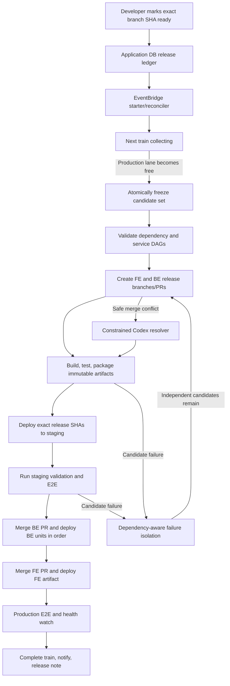

# Deployment Bus to Production — Implementation Plan

Status: proposed implementation specification.

This document defines the complete target architecture and build sequence for
the autonomous deployment bus. It is intended to be detailed enough for an
implementation agent to build the system without inventing missing lifecycle,
dependency, concurrency, or failure-handling behavior.

The plan makes the following architectural decisions:

- The existing application database is the durable release ledger.
- AWS Standard Step Functions orchestrates frozen release trains.
- EventBridge and a short-running Lambda start and reconcile trains.
- GitHub Actions performs builds, packaging, staging, E2E, and deployments.
- A GitHub App is the release-bus machine identity.
- A candidate is identified by immutable repository, branch, and head SHA.
- Frontend and backend use separate release branches and PRs linked by one
  release-train ID.
- Batching is dependency-aware rather than strict FIFO.
- Codex may resolve narrowly defined merge conflicts on temporary release
  branches only.
- At most one frozen train and one production deployment operation run at a
  time.

The no-human-intervention guarantee applies to the normal successful path. An
unrecoverable production incident may pause the lane and require a developer
fix.

## 1. Objective

After an authorized developer marks a branch ready, the system must:

1. Record its exact repository, branch, head SHA, dependencies, and backend
   deployment plan.
2. Wait until all dependencies are eligible.
3. Include it in the next possible release train.
4. Combine all currently eligible independent developments.
5. Build and validate the exact combined release.
6. Deploy that exact release to staging.
7. Run the required staging E2E packs.
8. Merge and deploy backend changes first.
9. Merge and deploy frontend changes after backend validation.
10. Validate production.
11. Mark candidates released and publish the release note.
12. Do all of this without another human approval.

An unrelated candidate must not be blocked merely because an older candidate
has an unresolved dependency.

## 2. Existing Foundation to Retain

Do not replace the existing frontend deployment-bus work. Extend it.

Relevant existing frontend components:

- `ops/docs/developer/deployment-bus-process.md`
- `ops/docs/developer/deployment-bus-automation.md`
- `ops/scripts/deployment-bus.cjs`
- `ops/deployment-bus/manifest.v1.schema.json`
- `.github/workflows/deploy-staging.yml`
- `.github/workflows/staging-e2e.yml`
- `.github/workflows/build-upload-deploy-prod.yml`

Relevant existing backend components in `6529seize-backend`:

- `src/config/deploy-services.json`
- `scripts/generate-deploy-config.mjs`
- `.github/workflows/deploy.yml`
- `src/api-serverless/src/deploy/deploy.routes.ts`
- `src/api-serverless/src/deploy/deploy.github.service.ts`
- `src/api-serverless/src/deploy/deploy-ui.renderer.ts`

Already implemented:

- Frontend deployment manifests and validation artifacts.
- Frontend staging and production workflows.
- Automatic staging E2E packs.
- Frontend `/api/version` verification.
- GitHub Deployment records.
- Backend UI for manually dispatching one service at a time.
- Per-service backend deployment registry.

Not implemented:

- The readiness queue.
- Immutable candidate handling.
- Cross-repository dependency handling.
- Automated batching.
- Release branch construction.
- Step Functions orchestration.
- Production-wide locking.
- Automatic backend/frontend coordination.
- Candidate failure isolation.
- Codex conflict resolution.
- Automatic merge and production promotion.

## 3. System Architecture



### 3.1 Backend components

- `releaseBusStarter` Lambda, scheduled every minute.
- `releaseBusWorker` Lambda, invoked by Step Functions.
- A Standard Step Functions state machine.
- Release-bus entities and database services.
- Readiness API and extensions to the existing `/deploy` UI.
- GitHub App client and webhook handler.
- Production and staging authorization gate.
- CloudWatch metrics, alarms, and reconciliation.

### 3.2 Frontend and backend GitHub components

- Release-branch composition workflows.
- Preflight and package workflows.
- Codex merge-conflict workflows.
- Exact-SHA staging support.
- Immutable artifact deployment support.
- Production authorization checks.
- Production validation workflows.

## 4. Database Model

Use the application DB. The authoritative tables live in production. Create
them in staging first for rollout testing.

Follow backend conventions:

- Add TypeORM entities under `src/entities`.
- Export entities from `src/entities/entities.ts`.
- Add table constants to `src/constants.ts`.
- Do not add foreign keys.
- Do not add database enum constraints.
- Enforce lifecycle rules in application code.
- Keep release-bus transactions short and separate from product-domain
  transactions.
- Prefer a dedicated DB user and connection pool even though it is the same
  database.

### 4.1 Tables

| Table | Purpose |
| --- | --- |
| `release_ready_deployments` | Immutable candidate records |
| `release_candidate_dependencies` | Candidate dependency DAG |
| `release_trains` | One release train and its lifecycle |
| `release_train_items` | Candidates frozen into a train |
| `release_train_operations` | Idempotent external operations |
| `release_train_evidence` | Build, artifact, staging, E2E, and production evidence |
| `release_deployment_lanes` | Global orchestration, staging, and production leases |
| `release_train_events` | Append-only audit history |

### 4.2 `release_ready_deployments`

Required fields:

- `id`
- `repository`
- `branch_name`
- `head_sha`
- `pr_number`, nullable
- `status`
- `ready_by_github_login`
- `ready_at`
- `deploy_plan_json`
- `metadata_version`
- `claimed_train_id`, nullable
- `hold_reason`, nullable
- `invalidated_at`, nullable
- `released_at`, nullable
- `created_at`
- `updated_at`
- `row_version`

Unique index:

```text
(repository, branch_name, head_sha)
```

Candidate statuses:

- `DRAFT`
- `READY`
- `CLAIMED`
- `BLOCKED`
- `SUPERSEDED`
- `QUARANTINED`
- `RELEASED`
- `CANCELLED`

A candidate row is immutable after becoming `READY`, except for lifecycle
fields. Changing dependencies or deployment metadata means cancelling and
marking the exact SHA ready again.

### 4.3 Dependencies

`release_candidate_dependencies` contains:

- `candidate_id`
- `depends_on_candidate_id`
- `required_state`
- timestamps

For the first version, support one dependency completion state:

```text
PRODUCTION_VALIDATED
```

At readiness time, a dependency supplied as repository and branch is resolved
to the dependency branch's current SHA. Create a `DRAFT` candidate for that
exact SHA if it does not exist.

Therefore:

- A can be ready while B is not ready.
- A remains blocked until that exact B SHA becomes ready and is released.
- If B changes, the old dependency does not silently follow the branch.
- A becomes `BLOCKED` with `DEPENDENCY_SUPERSEDED` until its metadata is
  reasserted.

Reject dependency cycles immediately.

### 4.4 Backend deployment plan

Store only allowlisted unit names and edges, never shell commands:

```json
{
  "units": ["dbMigrationsLoop", "api", "waveDecisionExecutionLoop"],
  "edges": [
    ["dbMigrationsLoop", "api"],
    ["dbMigrationsLoop", "waveDecisionExecutionLoop"]
  ]
}
```

Commands, AWS regions, function names, validation strategies, and packaging
adapters come from the committed backend deployment registry.

Extend `src/config/deploy-services.json` with:

- `deploy_adapter`
- `allowed_environments`
- `aws_region`
- `verification_targets`
- `validation_profile`
- `staging_policy`
- `default_dependencies`
- `automatic_rollback_supported`

Candidate dependencies and deploy-unit dependencies are two different DAGs:

- Candidate DAG: which developments may enter a train.
- Service DAG: which backend units deploy before other units.

### 4.5 Train and operation records

Each train records:

- Train ID and revision.
- Frozen cutoff timestamp.
- Frontend and backend base-main SHAs.
- Frontend and backend release branches and PRs.
- State machine execution ARN.
- Pinned release-bus worker version.
- Current status and failure reason.
- Start and completion timestamps.

Each external effect gets an operation record:

- Operation key.
- Train and revision.
- Operation type.
- Repository, environment, and service.
- Expected SHA and artifact digest.
- Attempt number.
- Status.
- GitHub run, PR, deployment ID, or AWS identifier.
- Redacted request and result metadata.
- Timestamps.

## 5. Readiness API and Deploy UI

Extend the existing backend `/deploy` subsystem. Do not build a separate
frontend application for this.

### 5.1 API

Implement:

```text
POST /deploy/release-candidates/ready
POST /deploy/release-candidates/{id}/cancel
GET  /deploy/release-candidates
GET  /deploy/release-trains
GET  /deploy/release-trains/{id}
POST /deploy/release-bus/pause
POST /deploy/release-bus/resume
POST /deploy/github/webhook
```

The readiness request contains:

```json
{
  "repository": "frontend",
  "branch": "feature/example",
  "expected_head_sha": "40-character-sha",
  "dependencies": [
    {
      "repository": "backend",
      "branch": "feature/api-change"
    }
  ],
  "deploy_plan": null
}
```

For a backend candidate, `deploy_plan` is required unless changed files
conclusively map to one service.

### 5.2 Readiness processing

The API must:

1. Authenticate the developer using the same GitHub-token mechanism as the
   existing deploy UI.
2. Verify the user has write permission in the repository.
3. Resolve the remote branch.
4. Compare it with `expected_head_sha`.
5. Reject the request if the branch changed during submission.
6. Resolve the source PR if one exists.
7. Resolve dependency branches to immutable candidate SHAs.
8. Validate candidate and service DAGs.
9. Insert the candidate idempotently.
10. Create or update a `Release Bus` commit status or check.
11. Return the candidate ID, exact SHA, and current hold reason.

The user cannot supply:

- Arbitrary workflow names.
- Arbitrary shell commands.
- AWS resource names.
- GitHub repositories outside the configured frontend and backend allowlist.

### 5.3 UI

Add to the existing deploy UI:

- A "Mark ready for production" action.
- Exact branch and SHA display.
- Dependency picker.
- Backend deploy-unit picker and ordering editor.
- Ready, blocked, claimed, and released status.
- Candidate cancellation.
- Current train and next-train queue.
- Per-operation workflow links.
- Pause state and audited break-glass controls.

## 6. Candidate Invalidation

Install a GitHub App webhook for branch push events.

When a ready branch changes:

- If the candidate is still `READY`, mark it `SUPERSEDED`.
- If it is only prospectively collecting, remove it from the prospective batch.
- Update the source PR with a comment.
- Require the new SHA to be marked ready explicitly.

Once a train is frozen:

- Its candidate SHA never changes.
- A later push to the developer branch does not change the running train.
- The new head is a separate future candidate.
- Cancellation after freeze creates a train-revision request.
- Once production merging has begun, cancellation is rejected as too late.

The scheduled reconciler must also compare remote branch heads. Webhooks
improve latency, but correctness must not depend on receiving every webhook.

## 7. GitHub App

Create one organization GitHub App for the bus.

Permissions:

- Metadata: read.
- Contents: read and write.
- Pull requests: read and write.
- Actions: read and write.
- Checks and statuses: read and write.
- Deployments: read and write.
- Issues: write, for PR comments.

Store the App ID, installation ID, private key, and webhook secret in AWS
Secrets Manager.

Add the App as a ruleset bypass actor so it can merge release PRs without a
human review. The bus must still explicitly require all configured checks to
pass before invoking the bypass merge.

The App must only create or update:

```text
release-bus/train-*
```

It must never write to developer branches.

Retain the existing user-token authentication only for determining who marked
a candidate ready. Never store developer tokens.

## 8. Idempotency and Concurrency

External systems cannot participate in the database transaction. Therefore
the goal is effectively-once execution through idempotency and reconciliation.

### 8.1 Operation keys

Use deterministic keys such as:

```text
train:{trainId}:revision:{revision}:compose:{repo}:{expectedSha}:attempt:1
train:{trainId}:revision:{revision}:preflight:{repo}:{expectedSha}:attempt:1
train:{trainId}:deploy:prod:{repo}:{service}:{artifactDigest}:attempt:1
train:{trainId}:merge:{repo}:{prNumber}:{expectedHeadSha}:attempt:1
```

A retry after a timeout uses the same key. Only a confirmed new attempt uses
`attempt:2`.

Before calling GitHub or AWS:

1. Insert or load the operation by unique operation key.
2. If it already succeeded, return its stored result.
3. If it is ambiguous, reconcile remote state.
4. Search for an existing deterministic branch, PR, workflow run, artifact,
   merge, or deployed version.
5. Create a new external effect only when absence is proven.

GitHub workflow inputs and run names must include the operation key so runs are
discoverable after an ambiguous dispatch response.

### 8.2 Lanes

Create lane rows:

- `global-orchestration`
- `global-staging`
- `global-production`

Rules:

- At most one frozen or executing train owns `global-orchestration`.
- At most one operation modifies shared staging.
- At most one production deployment operation runs across both repositories.
- Lane acquisition uses a transaction and `SELECT ... FOR UPDATE`.
- Leases have an owner, token, heartbeat, and expiration.
- Step Function polling renews leases.
- The reconciler may recover an expired lease only after verifying that no
  matching GitHub or AWS operation remains active.

Lambda reserved concurrency is a secondary safety mechanism, not the lock
itself.

## 9. Train Collection and Freezing

### 9.1 While production is busy

Ready candidates accumulate without starting builds or creating aggregate
branches.

There may be:

- One currently executing train.
- One prospective `COLLECTING` train.

### 9.2 Freeze algorithm

When the production and orchestration lane becomes available:

1. Read current frontend and backend `main` SHAs.
2. Verify every prospective candidate's branch still matches its recorded SHA.
3. Mark mismatches `SUPERSEDED`.
4. Take a database cutoff timestamp.
5. Select all `READY` candidates committed at or before the cutoff.
6. Build the candidate DAG.
7. Include candidates whose dependencies are already production validated and
   still present in production, or are ready and included in the same train.
8. Hold candidates with missing dependencies.
9. Apply transitive holds.
10. Keep unrelated candidates.
11. Reject cycles.
12. Topologically order candidates, using `ready_at, id` as the tie-breaker.
13. Create train items and mark them `CLAIMED` atomically.
14. Start one Step Functions execution.

Candidates committed after the cutoff wait for the next train.

## 10. Release Branch Construction

For every repository represented in the train, create:

```text
release-bus/train-{trainId}-r{revision}
```

The release branch starts from the recorded fresh `main` SHA.

Merge candidate SHAs, not branch heads, in topological order. Merge commits
must contain the release-bus identity and DCO signoff.

Create one release PR per repository. Link both PRs using the train ID.

The PR body must contain:

- Train ID and revision.
- Base-main SHA.
- Candidate branch names and exact SHAs.
- Original PRs.
- Candidate dependency DAG.
- Backend deploy-unit DAG.
- Expected staging and production gates.
- Links to the train UI.

The original developer PR is not merged separately. After release:

- If its head still equals the released SHA, comment and close it as released
  by the train.
- If its head has moved, comment that only the recorded SHA was released and
  leave the PR open.

Before merging a release PR, verify:

- Its head SHA is still the validated SHA.
- Current `main` is still the expected base.
- Required checks are green.
- The train still owns the production lane.

If `main` moved, increment the train revision, rebuild the release branch from
the new `main`, and rerun all gates.

## 11. Preflight and Immutable Artifacts

Do not build production code again after merging to `main`.

The preflight must produce the exact immutable artifact later deployed to
production.

### 11.1 Frontend

Add a `release-bus-preflight.yml` workflow that:

1. Checks out the exact release-branch SHA.
2. Installs dependencies through the `6529` wrapper in frozen mode.
3. Runs lint, type checking, tests, and production build.
4. Produces the deployable production bundle.
5. Calculates SHA-256.
6. Uploads the artifact to the deployment-bus S3 prefix.
7. Emits artifact URI, digest, source SHA, train ID, and operation key.

Refactor the production workflow so bus mode:

- Does not rebuild.
- Verifies `main` contains the expected release SHA.
- Downloads the exact artifact.
- Verifies its digest.
- Performs only deployment and validation stages.

### 11.2 Backend

Split the generated backend workflow into package and deployment concerns.

For every selected service:

1. Check out the exact backend release SHA.
2. Use frozen dependency installation.
3. Build and test.
4. Package the production deployment.
5. Upload the immutable package.
6. Record digest and adapter metadata.

Production deployment consumes the exact package.

Support adapters for:

- Serverless services.
- API ZIP deployment.
- Direct Lambda ZIP services.
- Existing special deploy scripts.

The deployment registry, not queue metadata, chooses the adapter.

Use an encrypted, versioned S3 artifact prefix:

```text
deployment-bus/{trainId}/{revision}/{environment}/{repository}/{service}/{sourceSha}/{digest}
```

Add retention and lifecycle rules, but retain evidence long enough for audits
and rollback.

## 12. Exact Staging Validation

Do not treat a normal merge into an ahead-of-main `1a-staging` branch as proof
that the production candidate was tested.

Modify the staging workflows to accept bus-only inputs:

- `release_train_id`
- `operation_key`
- `expected_sha`
- `artifact_uri`
- `artifact_sha256`

Bus staging deploys the exact frozen release SHA and artifact directly to the
shared staging environment.

Keep the existing `1a-staging` flow for normal developer use, but route it
through the same staging lane. If staging is busy:

- Record the developer staging request as deferred.
- Do not let it overwrite the bus candidate.
- Redispatch the latest deferred staging SHA after the bus releases the lane.

### 12.1 Staging order

1. Deploy backend units in service-DAG order.
2. Verify every backend deployment reports the expected SHA and artifact
   digest.
3. Deploy frontend staging.
4. Verify frontend `/api/version`.
5. Run the existing three Playwright packs.
6. Record run IDs, artifacts, and results.
7. Mark the train `STAGING_VALIDATED`.

Reuse earlier staging evidence only when all of these match exactly:

- Train revision.
- Frontend SHA.
- Backend SHA.
- Backend unit set.
- Artifact digests.
- Staging deployment run IDs.
- E2E run IDs and results.

Individual candidate staging evidence is not sufficient for a newly combined
batch.

After successful production completion, merge `main` back into `1a-staging`
without resetting it.

## 13. Production Sequence

Production order is:

1. Recheck current main SHAs and every staging artifact and evidence record.
2. Acquire `global-production`.
3. Merge the backend release PR.
4. Deploy backend units one at a time in topological order.
5. Validate each unit before proceeding.
6. Merge the frontend release PR only after required backend units are
   production validated.
7. Deploy the immutable frontend artifact.
8. Verify `/api/version`.
9. Run production read-only E2E.
10. Run the post-deployment health watch.
11. Complete the train.
12. Publish one combined GelatoBot release note.
13. Notify source PRs.
14. Release all lanes.
15. Clean temporary branches after a retention window.

Cross-repository dependencies that require frontend-before-backend are
rejected. Such releases must be redesigned for backward compatibility.

Schema changes follow expand/contract deployment:

- Additive schema first.
- Backend code compatible with the old frontend.
- Frontend compatible with old and new backend during transition.
- Destructive schema cleanup in a later train.

## 14. Workflow Authorization Gate

Every staging and production deployment workflow must call a release-bus
authorization gate before modifying AWS.

Inputs:

- Train ID.
- Operation key.
- Expected repository, ref, and SHA.
- Environment.
- Service.
- GitHub run ID.

The gate verifies:

- The operation exists.
- The operation key matches.
- The train owns the relevant lane.
- The SHA and artifact digest match.
- No other production operation is active.

A direct GitHub dispatch without a valid authorization must fail before
deployment.

Keep a separate break-glass path:

- Restricted to administrators.
- Requires a reason.
- Acquires the same production lane.
- Writes the same audit and operation records.
- Cannot silently overlap an automated train.

## 15. Step Functions Workflow

Use a Standard Workflow. Step Functions carries only IDs and small state
values; the DB remains authoritative.

Suggested states:

```text
LOAD_TRAIN
VERIFY_CANDIDATES
BUILD_DAGS
CREATE_REVISION
COMPOSE_BACKEND
COMPOSE_FRONTEND
WAIT_FOR_COMPOSITION
CREATE_RELEASE_PRS
DISPATCH_PREFLIGHTS
WAIT_FOR_PREFLIGHTS
EVALUATE_PREFLIGHTS
ACQUIRE_STAGING
DEPLOY_BACKEND_STAGING
DEPLOY_FRONTEND_STAGING
WAIT_FOR_STAGING_E2E
VALIDATE_STAGING_EVIDENCE
RECHECK_MAIN
ACQUIRE_PRODUCTION
MERGE_BACKEND
DEPLOY_BACKEND_PRODUCTION
VALIDATE_BACKEND_PRODUCTION
MERGE_FRONTEND
DEPLOY_FRONTEND_PRODUCTION
VALIDATE_FRONTEND_PRODUCTION
POST_DEPLOY_WATCH
FINALIZE_RELEASE
CLEANUP
```

Task Lambdas must return quickly. Waiting for GitHub or AWS happens through:

```text
Task -> Wait 60 seconds -> Poll Task -> Choice
```

Do not leave a Lambda waiting.

The worker should expose small action handlers rather than one giant function:

- `verifyCandidates`
- `freezeTrain`
- `createRevision`
- `dispatchOperation`
- `reconcileOperation`
- `evaluateGate`
- `isolateFailure`
- `finalizeTrain`

Pin each train to an immutable published version of `releaseBusWorker`. This
prevents a release-bus deployment from changing the behavior of an already
running train. Retain old worker versions until no execution references them.

## 16. Codex Merge-Conflict Handling

Codex may resolve only temporary release-branch conflicts.

Automatically eligible examples:

- Import ordering.
- Non-overlapping list additions.
- Generated files recreated through the official generator.
- Lockfiles regenerated through approved commands.
- Straightforward main drift where both changes can be preserved.

Never auto-resolve:

- Schema or data migrations.
- API contract conflicts.
- Authentication, authorization, or security code.
- Infrastructure or deployment configuration.
- Competing behavioral implementations.
- Conflicts requiring deletion of one side.
- Anything outside the conflicted files, except approved generated output.

Use `openai/codex-action@v1` with:

- A committed static prompt.
- `sandbox: workspace-write`.
- `safety-strategy: drop-sudo`.
- Ephemeral sessions.
- Structured JSON output.
- No production AWS credentials.
- No GitHub write token in the Codex job.

The Codex job generates a patch artifact. A separate job with no OpenAI key
validates and applies the patch, runs the full checks, creates a signed merge
commit, and pushes only the train branch. Follow the official
[Codex GitHub Action security guidance](https://learn.chatgpt.com/docs/github-action.md).

Every resolution must record:

- Conflict files.
- Patch digest.
- Codex result.
- Explanation.
- Test results.
- Resolution commit SHA.

Codex never decides that a candidate may be ejected, merged, or deployed.

## 17. Build and E2E Failure Isolation

When a gate fails:

1. Retry once to distinguish a transient failure.
2. Run the same gate against fresh `main` alone where applicable.
3. If `main` also fails, classify it as a baseline or infrastructure failure
   and pause; do not quarantine a candidate.
4. If the combined train alone fails, run dependency-aware delta debugging.
5. Test only dependency-closed subsets.
6. Identify the smallest reproducible failing candidate set.
7. If one candidate fails alone, quarantine it.
8. If only a combination fails, quarantine that minimal interaction set.
9. Transitively hold its dependants.
10. Rebuild the train revision with independent candidates.

For staging and E2E failures, subset isolation may require repeated staging
deployments. Cap the number of attempts. If the minimal offender cannot be
proven, hold the smallest unresolved connected component, not an arbitrarily
chosen PR.

Codex may summarize logs and produce a developer-facing diagnosis, but
deterministic tests decide the result.

Notify affected developers through:

- Original PR comments.
- Commit checks or statuses.
- The deploy UI.
- The existing CI and operations alert channel.

## 18. Production Failures

Once a release PR is merged, candidate ejection is no longer valid.

On production deployment or validation failure:

1. Stop the train.
2. Do not continue to frontend if backend failed.
3. Keep the production lane locked.
4. Attempt automatic rollback only for deploy units whose registry explicitly
   declares it supported.
5. Roll back using the last known healthy immutable artifact or version.
6. Validate the rollback.
7. Mark the train `ROLLED_BACK` or `PRODUCTION_FAILED`.
8. Notify developers and operations.
9. Prevent later trains from starting until production is healthy and the lane
   is explicitly reconciled.

Backend services should move toward published Lambda versions and aliases so
rollback is an alias change rather than rebuilding old code.

An arbitrary production incident cannot safely be delegated to Codex. The bus
may restore a known previous version, but it must not invent a production fix
and deploy it autonomously.

## 19. Exact A/B/C Sequence

Given:

- An old train is still deploying to production.
- A becomes ready.
- While the starter runs, B and C become ready.

The sequence is:

1. The old train continues to own `global-production`.
2. A is inserted as `READY`.
3. The starter sees production busy and ensures a prospective `COLLECTING`
   train exists.
4. It does not create aggregate branches or start builds.
5. B and C are committed as `READY`.
6. The old train completes its production validation.
7. The bus releases the old production lease.
8. The next starter run verifies all candidate SHAs.
9. It takes an atomic cutoff timestamp.
10. A, B, and C are included if their DB commits precede the cutoff.
11. A candidate committed after the cutoff waits for the following train.
12. Dependency closure is evaluated:
    - If A depends on B and B is ready, both enter.
    - If A depends on B and B is not ready, A remains blocked.
    - Independent C still enters.
13. The eligible set is atomically claimed.
14. The new train starts composition and validation.

If the old production deployment fails, the next train remains collecting and
does not advance until production is restored.

## 20. Implementation Work Packages

Every work package must use fresh worktrees from the newest `main` and follow
both repositories' `AGENTS.md` files and deployment skills.

### 20.1 Package 1: backward-compatible workflow contracts

Frontend:

- Add exact-SHA, train, and operation inputs.
- Add release-bus preflight.
- Add immutable artifact output.
- Extend the manifest schema and CLI while retaining v1 read compatibility.
- Add automatic production read-only E2E.

Backend:

- Extend the deployment registry.
- Update validation and generator.
- Split package and deploy responsibilities.
- Add exact-SHA, artifact, train, and operation inputs.
- Preserve the existing manual path temporarily.

Do not enforce gates yet.

### 20.2 Package 2: database and domain layer

Backend:

- Add all release entities and constants.
- Add repositories and services.
- Add status-transition validation.
- Add DAG validation and topological sorting.
- Add the idempotency operation service.
- Add lane acquisition and lease services.
- Add DB concurrency tests.

Deploy `dbMigrationsLoop` before any API or Lambda uses the tables.

### 20.3 Package 3: readiness API and UI

Backend:

- Add readiness, cancel, list, and train endpoints.
- Extend the existing deploy UI.
- Add GitHub user permission verification.
- Add commit statuses and PR notifications.
- Add `OFF`, `SHADOW`, `STAGING`, and `PRODUCTION` modes.

Deploy the API with bus mode `OFF`.

### 20.4 Package 4: GitHub App integration

Backend:

- Refactor the current GitHub service behind a reusable interface.
- Add GitHub App token generation.
- Add webhook signature verification.
- Add branch, PR, workflow, and merge reconciliation.
- Add deterministic operation correlation.
- Add webhook and mocked GitHub tests.

Install the App, secrets, labels, and ruleset bypass only after the code exists.

### 20.5 Package 5: release-bus infrastructure

Backend:

- Add `src/releaseBus/`.
- Add starter and worker Lambdas.
- Add the Standard Step Functions definition.
- Add the EventBridge schedule.
- Add versioned worker releases.
- Add IAM policies and Secrets Manager access.
- Add metrics, dashboards, and alarms.
- Add the service to the backend deployment registry.

Deploy with mode `OFF`, then `SHADOW`.

### 20.6 Package 6: release composition and Codex

Both repositories:

- Add train composition workflows.
- Add signed merge commits.
- Add release PR creation support.
- Add constrained Codex conflict workflows.
- Add patch validation.
- Add preflight and artifact packaging.
- Add release-branch cleanup.

### 20.7 Package 7: staging coordination

- Add the `global-staging` gate.
- Make bus staging deploy exact train SHAs.
- Queue or defer ordinary `1a-staging` requests while busy.
- Correlate existing staging E2E to exact train evidence.
- Verify backend unit versions.
- Run full end-to-end tests in staging mode.

### 20.8 Package 8: production coordination

- Enforce production authorization in both repositories.
- Add backend-first merge and deployment.
- Add service-DAG deployment.
- Add frontend deployment after backend validation.
- Add production E2E and health watch.
- Add rollback adapters.
- Add final manifest and GelatoBot release note.
- Enable `PRODUCTION` mode only after shadow and staging soak periods.

## 21. Zero-Downtime Rollout Order

1. Merge backward-compatible workflow changes.
2. Deploy release tables to staging through `dbMigrationsLoop`.
3. Deploy backend API changes to staging.
4. Deploy the release-bus Lambda and state machine to staging with mode `OFF`.
5. Test readiness and orchestration against sandbox repositories.
6. Enable `SHADOW`; create trains and operations without GitHub writes.
7. Enable `STAGING`; allow composition and exact staging validation but no
   production merges.
8. Deploy the additive tables to production through `dbMigrationsLoop`.
9. Deploy the production API.
10. Deploy production release-bus infrastructure with mode `OFF`.
11. Install GitHub App secrets and ruleset bypass.
12. Enable production `SHADOW` mode.
13. Compare shadow decisions with manual releases.
14. Enable production authorization gates.
15. Enable autonomous `PRODUCTION` mode.
16. Retain break-glass deployment and global pause controls.

Gate enforcement must be the final switch. Do not make existing production
workflows require bus authorization before the production bus is deployed and
healthy.

## 22. Required Testing

### 22.1 Backend unit and property tests

- Candidate state transitions.
- Immutable readiness.
- Push invalidation.
- DAG cycle detection.
- Topological ordering.
- Transitive holds.
- Independent candidate selection.
- Service-DAG union.
- Idempotency key generation.
- Operation reconciliation.
- Lane lease acquisition and recovery.
- Production authorization.

Use `fast-check` for DAG and state-transition properties where reasonable.

### 22.2 Database integration tests

Use the existing Testcontainers pattern to test:

- Simultaneous ready submissions.
- Two starters racing to freeze.
- Duplicate webhook delivery.
- Lease expiry and recovery.
- Ambiguous external-operation state.
- A candidate arriving exactly around the cutoff.
- One train completing while another is collecting.

### 22.3 Workflow tests

- YAML and action validation.
- Exact-SHA checkout.
- Artifact digest mismatch.
- Wrong train or operation key.
- Direct unauthorized deployment.
- Stale `main`.
- Existing workflow-run reconciliation.
- Codex safe and unsafe conflict fixtures.

### 22.4 End-to-end scenarios

- Frontend-only candidate.
- Backend-only candidate.
- Combined backend and frontend candidate.
- A depends on B across repositories.
- A depends on missing B while independent C releases.
- Backend service ordering.
- Candidate push before freeze.
- Candidate push after freeze.
- Main moves during preflight.
- Duplicate scheduler invocation.
- Merge conflict automatically resolved.
- Unsafe conflict held.
- Build failure isolated.
- Staging E2E failure isolated.
- Backend production failure prevents frontend merge.
- Successful rollback.
- Release-bus worker update while an old train is running.
- Full restart and reconciliation after killing the worker between an external
  call and its DB update.

## 23. Observability and Operations

Publish CloudWatch metrics for:

- Queue depth and oldest-ready age.
- Active train state and duration.
- Candidate holds and quarantine counts.
- Staging and production lane ownership.
- Stale lease and heartbeat age.
- Workflow dispatch and reconciliation failures.
- Build, staging, E2E, deployment, and rollback duration.
- Production failure and rollback status.

Add alarms for:

- A train stuck beyond its expected duration.
- An expired lane with an ambiguous external operation.
- Repeated starter or worker failures.
- A production deployment or validation failure.
- A GitHub webhook authentication failure spike.
- A release-note publication failure after a successful production release.

Every train transition and external operation must append a redacted event to
`release_train_events`. Do not place credentials, private URLs, raw production
data, hidden prompts, or unredacted workflow inputs in DB events, Step
Functions input, GitHub comments, or logs.

## 24. Security Requirements

- Keep GitHub App credentials and webhook secrets in Secrets Manager.
- Use short-lived GitHub App installation tokens.
- Give the release-bus Lambda no production deployment credentials; it should
  authorize and dispatch workflows instead.
- Give artifact builders write access only to the candidate artifact prefix.
- Give production workflows read access only to authorized artifact objects.
- Never expose the OpenAI API key to repository build or test steps.
- Run Codex in a separate job with no production AWS credentials and no GitHub
  write token.
- Use a static Codex prompt and sanitize all structured context derived from
  branches, PRs, commit messages, and logs.
- Allow the GitHub App to push only release-bus branches.
- Audit every ruleset-bypass merge.
- Require the same lane and operation checks for automated and break-glass
  deployment paths.

## 25. Documentation Closeout

After implementation:

- Update `ops/docs/developer/deployment-bus-process.md` so its operating model
  describes autonomous readiness as the production authorization rather than a
  later human production approval.
- Update `ops/docs/developer/deployment-bus-automation.md` with the implemented
  tables, states, workflows, APIs, and failure behavior.
- Update the frontend and backend `deploy-6529` skills with the new bus and
  break-glass procedures.
- Update backend `docs/architecture.md` for the new Lambda, Step Functions,
  EventBridge, DB entities, GitHub App integration, and artifact flow.
- Document GitHub App installation, Secrets Manager setup, ruleset bypass,
  pause and resume, rollback, lease recovery, and disaster recovery.
- Remove or clearly label stale statements about manual Playwright execution,
  queue collection, and human production promotion.

## 26. Definition of Done

The bus is complete only when all of the following are proven:

- A developer can mark a branch ready from `/deploy`.
- The recorded exact SHA cannot silently change.
- Dependencies work across frontend and backend.
- Service-level backend ordering works.
- Independent candidates are not blocked by unrelated holds.
- A frozen train cannot gain late candidates.
- Duplicate events cannot duplicate branches, PRs, merges, workflows,
  comments, or deployments.
- The exact combined train is validated on staging.
- The exact prebuilt production artifacts are deployed.
- Existing staging E2E results are machine-consumed.
- Backend deploys and validates before dependent frontend code is merged.
- Only one production deployment operation can run.
- Unauthorized GitHub production dispatches fail.
- Safe Codex resolutions are fully retested.
- Unsafe conflicts are held.
- Reproducibly failing candidates are removed while independent candidates
  continue.
- Production failure stops the train and invokes only declared rollback
  strategies.
- Every decision and external effect is auditable.
- Normal successful readiness-to-production requires no further human action.
- The deployment-bus process and automation documents describe the implemented
  system rather than future intentions.
