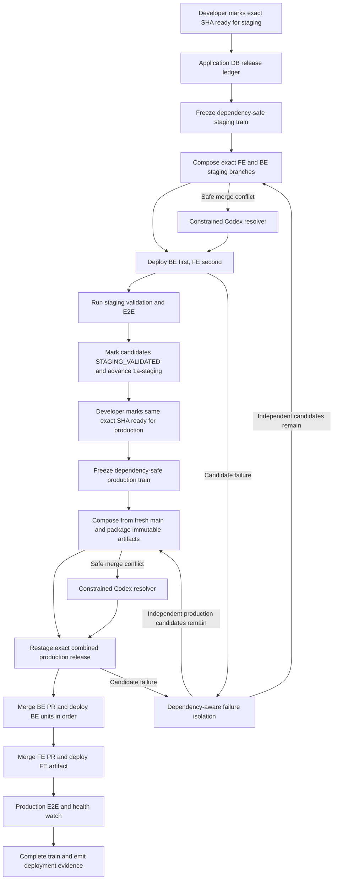

# Deployment Bus for Staging and Production — Implementation Plan

Status: proposed implementation specification.

This document defines the complete target architecture and build sequence for
the autonomous deployment bus. It is intended to be detailed enough for an
implementation agent to build the system without inventing missing lifecycle,
dependency, concurrency, or failure-handling behavior.

The plan makes the following architectural decisions:

- The existing application database is the durable release ledger.
- AWS Standard Step Functions orchestrates frozen release trains.
- EventBridge and a short-running Lambda start and reconcile trains.
- GitHub Actions performs builds, packaging, staging, E2E, and deployments.
- A GitHub App is the release-bus machine identity.
- A candidate is identified by immutable repository, branch, and head SHA.
- Frontend and backend use separate train branches linked by one train ID;
  production trains also use separate release PRs.
- Batching is dependency-aware rather than strict FIFO.
- Codex may resolve narrowly defined merge conflicts on temporary release
  branches only.
- At most one frozen train, one staging deployment operation, and one
  production deployment operation run at a time.

The no-human-intervention guarantee applies to the normal successful staging
and production paths. An unrecoverable production incident may pause the lane
and require a developer fix.

## 1. Objective

After an authorized developer marks an exact branch SHA ready for staging, the
system must:

1. Record its exact repository, branch, head SHA, dependencies, and backend
   deployment plan.
2. Wait until all staging dependencies are eligible.
3. Include it in the next possible staging train.
4. Combine all currently eligible independent developments.
5. Build the exact combined staging candidate.
6. Deploy required backend services first and frontend second.
7. Run the required staging E2E packs.
8. Record the exact staging evidence and mark each passing candidate
   `STAGING_VALIDATED`.
9. Fast-forward `1a-staging` to the successfully validated train head.

After staging validation, an authorized developer or agent may separately mark
that same exact SHA ready for production. The system must then:

1. Wait until all production dependencies are eligible.
2. Include it in the next possible production train.
3. Build and validate the exact combined production release from fresh
   `main`.
4. Restage that exact combined release set; older candidate-level staging
   evidence alone is not sufficient.
5. Merge and deploy backend changes first.
6. Merge and deploy frontend changes after backend validation.
7. Validate production and mark the candidates `PRODUCTION_VALIDATED`.
8. Emit complete merge and deployment evidence for the independent autonomous
   release-note bot.
9. Do all of this without another human approval.

An unrelated candidate must not be blocked merely because an older candidate
has an unresolved dependency.

## 2. Existing Foundation to Retain

Do not replace the existing frontend deployment-bus work. Extend it.

Relevant existing frontend components:

- `ops/docs/developer/deployment-bus-process.md`
- `ops/docs/developer/deployment-bus-automation.md`
- `ops/scripts/deployment-bus.cjs`
- `ops/deployment-bus/manifest.v1.schema.json`
- `.github/workflows/deploy-staging.yml`
- `.github/workflows/staging-e2e.yml`
- `.github/workflows/build-upload-deploy-prod.yml`

Relevant existing backend components in `6529seize-backend`:

- `src/config/deploy-services.json`
- `scripts/generate-deploy-config.mjs`
- `.github/workflows/deploy.yml`
- `src/api-serverless/src/deploy/deploy.routes.ts`
- `src/api-serverless/src/deploy/deploy.github.service.ts`
- `src/api-serverless/src/deploy/deploy-ui.renderer.ts`

Already implemented:

- Frontend deployment manifests and validation artifacts.
- Frontend staging and production workflows.
- Automatic staging E2E packs.
- Frontend `/api/version` verification.
- GitHub Deployment records.
- Backend UI for manually dispatching one service at a time.
- Per-service backend deployment registry.

Not implemented:

- The readiness queue.
- Automated `1a-staging` branch ownership and staging deployment.
- Immutable candidate handling.
- Cross-repository dependency handling.
- Automated batching.
- Release branch construction.
- Step Functions orchestration.
- Staging-wide and production-wide locking.
- Automatic backend/frontend coordination.
- Candidate failure isolation.
- Codex conflict resolution.
- Automatic merge and production promotion.

## 3. System Architecture



### 3.1 Backend components

- `releaseBusStarter` Lambda, scheduled every minute.
- `releaseBusWorker` Lambda, invoked by Step Functions.
- A Standard Step Functions state machine.
- Release-bus entities and database services.
- Readiness API and extensions to the existing `/deploy` UI.
- GitHub App client and webhook handler.
- Production and staging authorization gate.
- CloudWatch metrics, alarms, and reconciliation.

### 3.2 Frontend and backend GitHub components

- Release-branch composition workflows.
- Preflight and package workflows.
- Codex merge-conflict workflows.
- Exact-SHA staging support.
- Immutable artifact deployment support.
- Staging and production authorization checks.
- Production validation workflows.

## 4. Database Model

Use the application DB. The authoritative tables live in production. Create
them in staging first for rollout testing.

Follow backend conventions:

- Add TypeORM entities under `src/entities`.
- Export entities from `src/entities/entities.ts`.
- Add table constants to `src/constants.ts`.
- Do not add foreign keys.
- Do not add database enum constraints.
- Enforce lifecycle rules in application code.
- Keep release-bus transactions short and separate from product-domain
  transactions.
- Prefer a dedicated DB user and connection pool even though it is the same
  database.

### 4.1 Tables

| Table | Purpose |
| --- | --- |
| `release_ready_deployments` | Immutable candidate records |
| `release_candidate_dependencies` | Candidate dependency DAG |
| `release_trains` | One release train and its lifecycle |
| `release_train_items` | Candidates frozen into a train |
| `release_train_operations` | Idempotent external operations |
| `release_train_evidence` | Build, artifact, staging, E2E, and production evidence |
| `release_deployment_lanes` | Global orchestration, staging, and production leases |
| `release_bus_controls` | Durable pause state for all, staging, and production scopes |
| `release_train_events` | Append-only audit history |

### 4.2 `release_ready_deployments`

Required fields:

- `id`
- `repository`
- `branch_name`
- `head_sha`
- `pr_number`, nullable
- `status`
- `staging_ready_by_github_login`, nullable
- `staging_ready_at`, nullable
- `production_ready_by_github_login`, nullable
- `production_ready_at`, nullable
- `deploy_plan_json`
- `metadata_version`
- `current_train_id`, nullable
- `hold_reason`, nullable
- `invalidated_at`, nullable
- `released_at`, nullable
- `created_at`
- `updated_at`
- `row_version`

Unique index:

```text
(repository, branch_name, head_sha)
```

Candidate statuses:

- `DRAFT`
- `READY_FOR_STAGING`
- `STAGING_CLAIMED`
- `STAGING_VALIDATING`
- `STAGING_VALIDATED`
- `STAGING_FAILED`
- `READY_FOR_PRODUCTION`
- `PRODUCTION_CLAIMED`
- `PRODUCTION_VALIDATING`
- `PRODUCTION_VALIDATED`
- `BLOCKED`
- `SUPERSEDED`
- `QUARANTINED`
- `CANCELLED`

A candidate row is immutable after becoming `READY_FOR_STAGING`, except for
lifecycle fields. Changing dependencies or deployment metadata means
cancelling and marking the exact SHA ready again. A candidate may transition
to `READY_FOR_PRODUCTION` only after that exact SHA reaches
`STAGING_VALIDATED`.

### 4.3 Dependencies

`release_candidate_dependencies` contains:

- `candidate_id`
- `depends_on_candidate_id`
- `required_state`
- timestamps

Support dependency completion states for both lanes:

```text
STAGING_VALIDATED
PRODUCTION_VALIDATED
```

A required state means the exact candidate has reached that state and has
durable evidence for it; it does not require that value to remain the
candidate's current lifecycle status after the candidate advances to a later
lane.

At readiness time, a dependency supplied as repository and branch is resolved
to the dependency branch's current SHA. Create a `DRAFT` candidate for that
exact SHA if it does not exist.

Therefore:

- A can be ready for staging or production while B is not ready for the same
  lane.
- A remains blocked until that exact B SHA is included in the same train or has
  already reached the required validation state.
- If B changes, the old dependency does not silently follow the branch.
- A becomes `BLOCKED` with `DEPENDENCY_SUPERSEDED` until its metadata is
  reasserted.

Reject dependency cycles immediately.

### 4.4 Backend deployment plan

Store only allowlisted unit names and edges, never shell commands:

```json
{
  "units": ["dbMigrationsLoop", "api", "waveDecisionExecutionLoop"],
  "edges": [
    ["dbMigrationsLoop", "api"],
    ["dbMigrationsLoop", "waveDecisionExecutionLoop"]
  ]
}
```

Commands, AWS regions, function names, validation strategies, and packaging
adapters come from the committed backend deployment registry.

Extend `src/config/deploy-services.json` with:

- `deploy_adapter`
- `allowed_environments`
- `aws_region`
- `verification_targets`
- `validation_profile`
- `staging_policy`
- `default_dependencies`
- `automatic_rollback_supported`

Candidate dependencies and deploy-unit dependencies are two different DAGs:

- Candidate DAG: which developments may enter a train.
- Service DAG: which backend units deploy before other units.

### 4.5 Train and operation records

Each train records:

- Train ID and revision.
- Target lane: `STAGING` or `PRODUCTION`.
- Frozen cutoff timestamp.
- Frontend and backend target-branch base SHAs: `1a-staging` for staging trains
  and `main` for production trains.
- Frontend and backend release branches and PRs.
- State machine execution ARN.
- Pinned release-bus worker version.
- Current status and failure reason.
- Start and completion timestamps.

`release_bus_controls` contains one row for each of `ALL`, `STAGING`, and
`PRODUCTION`, with paused state, reason, GitHub actor, timestamp, and row
version. The starter checks it before freezing a train, and the worker checks
it before every irreversible branch movement, merge, or deployment operation.

Each external effect gets an operation record:

- Operation key.
- Train and revision.
- Operation type.
- Repository, environment, and service.
- Expected SHA and artifact digest.
- Attempt number.
- Status.
- GitHub run, PR, deployment ID, or AWS identifier.
- Redacted request and result metadata.
- Timestamps.

## 5. Readiness API and Deploy UI

Extend the existing backend `/deploy` subsystem. Do not build a separate
frontend application for this.

### 5.1 API

Implement:

```text
POST /deploy/release-candidates/ready
POST /deploy/release-candidates/{id}/cancel
GET  /deploy/release-candidates
GET  /deploy/release-trains
GET  /deploy/release-trains/{id}
POST /deploy/release-bus/pause
POST /deploy/release-bus/resume
POST /deploy/github/webhook
```

The readiness request contains:

```json
{
  "repository": "frontend",
  "branch": "feature/example",
  "expected_head_sha": "40-character-sha",
  "target_lane": "STAGING",
  "dependencies": [
    {
      "repository": "backend",
      "branch": "feature/api-change"
    }
  ],
  "deploy_plan": null
}
```

For a backend candidate, `deploy_plan` is required unless changed files
conclusively map to one service.

`target_lane` is `STAGING` or `PRODUCTION`. A production-ready request is
accepted only when the same repository, branch, and SHA already has
`STAGING_VALIDATED` evidence. The production train still restages its exact
combined release set before promotion.

### 5.2 Readiness processing

The API must:

1. Authenticate the developer using the same GitHub-token mechanism as the
   existing deploy UI.
2. Verify the user has write permission in the repository.
3. Resolve the remote branch.
4. Compare it with `expected_head_sha`.
5. Reject the request if the branch changed during submission.
6. Resolve the source PR if one exists.
7. Resolve dependency branches to immutable candidate SHAs.
8. Validate candidate and service DAGs.
9. Validate that the requested staging or production lifecycle transition is
   allowed.
10. Insert or transition the candidate idempotently.
11. Create or update a `Release Bus` commit status or check.
12. Return the candidate ID, exact SHA, lane, and current hold reason.

The user cannot supply:

- Arbitrary workflow names.
- Arbitrary shell commands.
- AWS resource names.
- GitHub repositories outside the configured frontend and backend allowlist.

### 5.3 UI

Add to the existing deploy UI:

- Separate "Mark ready for staging" and "Mark ready for production" actions.
- Exact branch and SHA display.
- Dependency picker.
- Backend deploy-unit picker and ordering editor.
- Staging and production readiness, blocked, claimed, validating, and
  validated status.
- Candidate cancellation.
- Current staging and production trains and their next-train queues.
- Per-operation workflow links.
- Operator-only pause, resume, reconciliation, and audited break-glass
  controls.

Anyone with write access to the relevant repository may mark a candidate
ready. Pause, resume, stale-lane reconciliation, and break-glass controls
require membership in a configured GitHub organization team such as
`release-bus-operators`, or organization-owner status. Do not hardcode a user
allowlist in application code.

Pause and resume requests specify `ALL`, `STAGING`, or `PRODUCTION` plus an
audited reason. A pause prevents the next irreversible operation from starting;
it does not abruptly terminate an AWS deployment that is already mutating the
environment. That operation reaches a safe terminal state, after which the
train remains paused until an operator resumes or reconciles it.

## 6. Candidate Invalidation

Install a GitHub App webhook for branch push events.

When a ready branch changes:

- If the candidate is waiting for staging or production, mark it
  `SUPERSEDED`.
- Invalidate all staging evidence for the old branch head as evidence for the
  new head.
- If it is only prospectively collecting, remove it from the prospective batch.
- Update the source PR with a comment.
- Require the new SHA to be marked ready explicitly.

Once a train is frozen:

- Its candidate SHA never changes.
- A later push to the developer branch does not change the running train.
- The new head is a separate future candidate.
- Cancellation after a staging or production freeze creates a train-revision
  request.
- Once production merging has begun, cancellation is rejected as too late.

The scheduled reconciler must also compare remote branch heads. Webhooks
improve latency, but correctness must not depend on receiving every webhook.

## 7. GitHub App

Create one organization GitHub App for the bus.

Permissions:

- Metadata: read.
- Contents: read and write.
- Pull requests: read and write.
- Actions: read and write.
- Checks and statuses: read and write.
- Deployments: read and write.
- Issues: write, for PR comments.

Store the App ID, installation ID, private key, and webhook secret in AWS
Secrets Manager.

Add the App as a ruleset bypass actor so it can merge release PRs without a
human review. The bus must still explicitly require all configured checks to
pass before invoking the bypass merge.

Protect `1a-staging` in both repositories against direct developer updates,
force pushes, and deletion. Its normal update actor is the GitHub App after a
validated staging train. A configured release-operator team may bypass this
only through the audited break-glass procedure.

The App must only create or update:

```text
release-bus/staging-train-*
release-bus/production-train-*
1a-staging
```

Updates to `1a-staging` require successful exact-train staging evidence and an
expected-old-SHA fast-forward. The App must never write to developer branches
or push directly to `main`; production enters `main` only through the validated
release PR path.

Retain the existing user-token authentication only for determining who marked
a candidate ready. Never store developer tokens.

## 8. Idempotency and Concurrency

External systems cannot participate in the database transaction. Therefore
the goal is effectively-once execution through idempotency and reconciliation.

### 8.1 Operation keys

Use deterministic keys such as:

```text
train:{trainId}:revision:{revision}:compose:{repo}:{expectedSha}:attempt:1
train:{trainId}:revision:{revision}:preflight:{repo}:{expectedSha}:attempt:1
train:{trainId}:deploy:staging:{repo}:{service}:{artifactDigest}:attempt:1
train:{trainId}:advance:1a-staging:{repo}:{expectedOldSha}:{newSha}:attempt:1
train:{trainId}:deploy:prod:{repo}:{service}:{artifactDigest}:attempt:1
train:{trainId}:merge:{repo}:{prNumber}:{expectedHeadSha}:attempt:1
```

A retry after a timeout uses the same key. Only a confirmed new attempt uses
`attempt:2`.

Before calling GitHub or AWS:

1. Insert or load the operation by unique operation key.
2. If it already succeeded, return its stored result.
3. If it is ambiguous, reconcile remote state.
4. Search for an existing deterministic branch, PR, workflow run, artifact,
   merge, or deployed version.
5. Create a new external effect only when absence is proven.

GitHub workflow inputs and run names must include the operation key so runs are
discoverable after an ambiguous dispatch response.

### 8.2 Lanes

Create lane rows:

- `global-orchestration`
- `global-staging`
- `global-production`

Rules:

- At most one frozen or executing train owns `global-orchestration`.
- At most one operation modifies shared staging.
- At most one production deployment operation runs across both repositories.
- Lane acquisition uses a transaction and `SELECT ... FOR UPDATE`.
- Leases have an owner, token, heartbeat, and expiration.
- Step Function polling renews leases.
- The reconciler may recover an expired lease only after verifying that no
  matching GitHub or AWS operation remains active.

Lambda reserved concurrency is a secondary safety mechanism, not the lock
itself.

## 9. Train Collection and Freezing

The bus maintains separate prospective staging and production queues while
allowing only one frozen or executing train across both lanes. Production-ready
work has priority when both queues can depart; otherwise staging departs as
soon as the shared orchestration and staging lanes are free.

Ready candidates accumulate without creating aggregate branches while another
train owns the orchestration lane. There may be:

- One currently frozen or executing train.
- One prospective `COLLECTING_STAGING` train.
- One prospective `COLLECTING_PRODUCTION` train.

### 9.1 Staging freeze

When the orchestration and staging lanes are available and no eligible
production train is waiting:

1. Read current frontend and backend `1a-staging` SHAs.
2. Verify every prospective candidate's branch still matches its recorded SHA.
3. Mark mismatches `SUPERSEDED`.
4. Take a database cutoff timestamp.
5. Select all `READY_FOR_STAGING` candidates committed at or before the cutoff.
6. Build the candidate DAG.
7. Include candidates whose dependencies are already `STAGING_VALIDATED`, or
   are ready for staging and included in the same train.
8. Hold candidates with missing dependencies and apply transitive holds.
9. Keep unrelated candidates.
10. Reject cycles.
11. Topologically order candidates, using `staging_ready_at, id` as the
    tie-breaker.
12. Create train items and mark them `STAGING_CLAIMED` atomically.
13. Start one Step Functions execution with target lane `STAGING`.

### 9.2 Production freeze

When the orchestration and production lanes are available:

1. Read current frontend and backend `main` SHAs.
2. Verify every prospective candidate's branch still matches its recorded SHA.
3. Require exact-SHA `STAGING_VALIDATED` evidence for every candidate.
4. Mark mismatches `SUPERSEDED`.
5. Take a database cutoff timestamp.
6. Select all `READY_FOR_PRODUCTION` candidates committed at or before the
   cutoff.
7. Build the candidate DAG.
8. Include candidates whose dependencies are already
   `PRODUCTION_VALIDATED` and still present in production, or are ready for
   production and included in the same train.
9. Hold candidates with missing dependencies and apply transitive holds.
10. Keep unrelated candidates and reject cycles.
11. Topologically order candidates, using `production_ready_at, id` as the
    tie-breaker.
12. Create train items and mark them `PRODUCTION_CLAIMED` atomically.
13. Start one Step Functions execution with target lane `PRODUCTION`.

Candidates committed after either cutoff wait for the next train for that
lane.

## 10. Release Branch Construction

For every repository represented in the train, create:

```text
release-bus/{targetLane}-train-{trainId}-r{revision}
```

A staging train branch starts from the recorded fresh `1a-staging` SHA. A
production train branch starts from the recorded fresh `main` SHA.

Merge candidate SHAs, not branch heads, in topological order. Merge commits
must contain the release-bus identity and DCO signoff.

Production trains create one release PR per repository and link both PRs using
the train ID. Staging trains do not require a human-reviewed PR: after exact-SHA
staging validation succeeds, the GitHub App fast-forwards each repository's
`1a-staging` ref to the validated train head. The fast-forward must fail rather
than overwrite if `1a-staging` moved after the train was composed; in that case
create a new revision and rerun staging.

Each production PR body, and every staging train manifest, must contain:

- Train ID and revision.
- Base-main SHA.
- Candidate branch names and exact SHAs.
- Original PRs.
- Candidate dependency DAG.
- Backend deploy-unit DAG.
- Expected staging and production gates.
- Links to the train UI.

The original developer PR is not merged separately. After production release:

- If its head still equals the released SHA, comment and close it as released
  by the train.
- If its head has moved, comment that only the recorded SHA was released and
  leave the PR open.

Before advancing `1a-staging` or merging a production release PR, verify:

- Its head SHA is still the validated SHA.
- Current target branch is still the expected base.
- Required checks are green.
- The train still owns the production lane.

If `1a-staging` or `main` moved, increment the train revision, rebuild the train
branch from the new target-branch head, and rerun all gates for that lane.

## 11. Preflight and Immutable Artifacts

Do not build production code again after merging to `main`.

A staging train preflight produces immutable staging artifacts. A production
train preflight produces both the staging-configured artifacts used to restage
the combined release and the production-configured artifacts later deployed to
production. Every artifact is bound to the same exact train SHA and its own
environment-specific digest.

### 11.1 Frontend

Add a `release-bus-preflight.yml` workflow that:

1. Checks out the exact release-branch SHA.
2. Installs dependencies through the `6529` wrapper in frozen mode.
3. Runs lint, type checking, tests, and the requested environment build.
4. Produces the deployable staging or production bundle.
5. Calculates SHA-256.
6. Uploads the artifact to the deployment-bus S3 prefix.
7. Emits artifact URI, digest, source SHA, train ID, and operation key.

Refactor the production workflow so bus mode:

- Does not rebuild.
- Verifies `main` contains the expected release SHA.
- Downloads the exact artifact.
- Verifies its digest.
- Performs only deployment and validation stages.

### 11.2 Backend

Split the generated backend workflow into package and deployment concerns.

For every selected service:

1. Check out the exact backend release SHA.
2. Use frozen dependency installation.
3. Build and test.
4. Package the requested staging or production deployment.
5. Upload the immutable package.
6. Record digest and adapter metadata.

Staging and production deployments consume their exact environment-specific
packages.

Support adapters for:

- Serverless services.
- API ZIP deployment.
- Direct Lambda ZIP services.
- Existing special deploy scripts.

The deployment registry, not queue metadata, chooses the adapter.

Use an encrypted, versioned S3 artifact prefix:

```text
deployment-bus/{trainId}/{revision}/{environment}/{repository}/{service}/{sourceSha}/{digest}
```

Add retention and lifecycle rules, but retain evidence long enough for audits
and rollback.

## 12. Bus-Owned Staging and Exact Validation

Developers and their agents do not normally merge branches into `1a-staging`
or dispatch staging deployments. They mark an exact SHA ready for staging and
wait for the bus to compose, deploy, validate, and report the staging train.
Manual branch movement and staging dispatch remain available only through the
audited operator break-glass path.

Do not put an unvalidated train onto `1a-staging`. If E2E later fails, keeping
the failed train out of the integration branch allows independent candidates
to form a new staging train without inheriting the failure.

Modify the staging workflows to accept bus-only inputs:

- `release_train_id`
- `operation_key`
- `expected_sha`
- `artifact_uri`
- `artifact_sha256`

The bus deploys the exact temporary staging-train SHA and artifact directly to
the shared staging environment. After every required check passes, it
fast-forwards `1a-staging` to that already-validated train head. The normal push
trigger must recognize the recorded successful bus operation and exit without
redeploying the same SHA.

### 12.1 Staging order

1. Freeze the dependency-safe `READY_FOR_STAGING` candidate set.
2. Compose backend and frontend staging train branches from their respective
   current `1a-staging` heads.
3. Run preflight before changing either integration branch.
4. Acquire `global-staging`.
5. Deploy backend units from the exact backend train SHA in service-DAG order.
6. Verify every backend deployment reports the expected SHA and artifact
   digest.
7. Deploy frontend staging from the exact frontend train SHA.
8. Verify frontend `/api/version`.
9. Run the existing three Playwright packs.
10. Record run IDs, artifacts, and results.
11. Atomically mark train items `STAGING_VALIDATED`.
12. Fast-forward backend `1a-staging`, then frontend `1a-staging`, to their
    validated train heads using expected-old-SHA comparisons.
13. Release the staging and orchestration lanes and notify candidate owners.

If either `1a-staging` branch moved before the fast-forward, do not overwrite
it. Recompose from the new branch head and rerun the staging gates.

Reuse earlier staging evidence only when all of these match exactly:

- Train revision.
- Frontend SHA.
- Backend SHA.
- Backend unit set.
- Artifact digests.
- Staging deployment run IDs.
- E2E run IDs and results.

Candidate-level staging proves that a development is eligible to be marked
ready for production. It is not by itself sufficient evidence for a newly
combined production batch. Every production train is composed from fresh
`main` and restaged as its exact combined release set before any production
merge.

After successful production completion, merge `main` back into `1a-staging`
without resetting it. This sync is bus-owned and must not trigger a duplicate
staging deployment when the deployed SHA and evidence are already current.

## 13. Production Sequence

Production order is:

1. Recheck current main SHAs and every staging artifact and evidence record.
2. Acquire `global-production`.
3. Merge the backend release PR.
4. Deploy backend units one at a time in topological order.
5. Validate each unit before proceeding.
6. Merge the frontend release PR only after required backend units are
   production validated.
7. Deploy the immutable frontend artifact.
8. Verify `/api/version`.
9. Run production read-only E2E.
10. Run the post-deployment health watch.
11. Complete the train.
12. Persist and emit complete merge, deployment, and validation evidence for
    the independent autonomous release-note bot.
13. Notify source PRs.
14. Release all lanes.
15. Clean temporary branches after a retention window.

Release-note publication is outside the deployment bus. The existing
autonomous release-note bot independently observes frontend and backend `main`
and successful production deployments; the bus must neither invoke a personal
skill nor publish a release note itself.

Cross-repository dependencies that require frontend-before-backend are
rejected. Such releases must be redesigned for backward compatibility.

Schema changes follow expand/contract deployment:

- Additive schema first.
- Backend code compatible with the old frontend.
- Frontend compatible with old and new backend during transition.
- Destructive schema cleanup in a later train.

## 14. Workflow Authorization Gate

Every staging and production deployment workflow must call a release-bus
authorization gate before modifying AWS.

Inputs:

- Train ID.
- Operation key.
- Expected repository, ref, and SHA.
- Environment.
- Service.
- GitHub run ID.

The gate verifies:

- The operation exists.
- The operation key matches.
- The train owns the relevant lane.
- The SHA and artifact digest match.
- No other operation is active in the target environment.

A direct GitHub dispatch without a valid authorization must fail before
deployment.

Keep a separate break-glass path:

- Restricted to administrators.
- Requires a reason.
- Acquires the same staging or production lane as an automated operation.
- Writes the same audit and operation records.
- Cannot silently overlap an automated train.

## 15. Step Functions Workflow

Use a Standard Workflow. Step Functions carries only IDs and small state
values; the DB remains authoritative.

Suggested states:

```text
LOAD_TRAIN
VERIFY_CANDIDATES
BUILD_DAGS
CREATE_REVISION
COMPOSE_BACKEND
COMPOSE_FRONTEND
WAIT_FOR_COMPOSITION
DISPATCH_PREFLIGHTS
WAIT_FOR_PREFLIGHTS
EVALUATE_PREFLIGHTS
CHOOSE_TARGET_LANE

# STAGING target
ACQUIRE_STAGING
DEPLOY_BACKEND_STAGING
DEPLOY_FRONTEND_STAGING
WAIT_FOR_STAGING_E2E
VALIDATE_STAGING_EVIDENCE
ADVANCE_BACKEND_1A_STAGING
ADVANCE_FRONTEND_1A_STAGING
FINALIZE_STAGING
CLEANUP_STAGING
END

# PRODUCTION target
CREATE_RELEASE_PRS
ACQUIRE_STAGING
DEPLOY_BACKEND_STAGING
DEPLOY_FRONTEND_STAGING
WAIT_FOR_STAGING_E2E
VALIDATE_STAGING_EVIDENCE
RECHECK_MAIN
ACQUIRE_PRODUCTION
MERGE_BACKEND
DEPLOY_BACKEND_PRODUCTION
VALIDATE_BACKEND_PRODUCTION
MERGE_FRONTEND
DEPLOY_FRONTEND_PRODUCTION
VALIDATE_FRONTEND_PRODUCTION
POST_DEPLOY_WATCH
FINALIZE_PRODUCTION
CLEANUP_PRODUCTION
END
```

Task Lambdas must return quickly. Waiting for GitHub or AWS happens through:

```text
Task -> Wait 60 seconds -> Poll Task -> Choice
```

Do not leave a Lambda waiting.

The worker should expose small action handlers rather than one giant function:

- `verifyCandidates`
- `freezeTrain`
- `createRevision`
- `dispatchOperation`
- `reconcileOperation`
- `evaluateGate`
- `isolateFailure`
- `finalizeTrain`

Pin each train to an immutable published version of `releaseBusWorker`. This
prevents a release-bus deployment from changing the behavior of an already
running train. Retain old worker versions until no execution references them.

## 16. Codex Merge-Conflict Handling

Codex may resolve only temporary release-branch conflicts.

Automatically eligible examples:

- Import ordering.
- Non-overlapping list additions.
- Generated files recreated through the official generator.
- Lockfiles regenerated through approved commands.
- Straightforward main drift where both changes can be preserved.

Never auto-resolve:

- Schema or data migrations.
- API contract conflicts.
- Authentication, authorization, or security code.
- Infrastructure or deployment configuration.
- Competing behavioral implementations.
- Conflicts requiring deletion of one side.
- Anything outside the conflicted files, except approved generated output.

Use `openai/codex-action@v1` with:

- A committed static prompt.
- `sandbox: workspace-write`.
- `safety-strategy: drop-sudo`.
- Ephemeral sessions.
- Structured JSON output.
- No production AWS credentials.
- No GitHub write token in the Codex job.

The Codex job generates a patch artifact. A separate job with no OpenAI key
validates and applies the patch, runs the full checks, creates a signed merge
commit, and pushes only the train branch. Follow the official
[Codex GitHub Action security guidance](https://learn.chatgpt.com/docs/github-action.md).

Every resolution must record:

- Conflict files.
- Patch digest.
- Codex result.
- Explanation.
- Test results.
- Resolution commit SHA.

Codex never decides that a candidate may be ejected, merged, or deployed.

## 17. Build and E2E Failure Isolation

When a gate fails:

1. Retry once to distinguish a transient failure.
2. Run the same gate against fresh `main` alone where applicable.
3. If `main` also fails, classify it as a baseline or infrastructure failure
   and pause; do not quarantine a candidate.
4. If the combined train alone fails, run dependency-aware delta debugging.
5. Test only dependency-closed subsets.
6. Identify the smallest reproducible failing candidate set.
7. If one candidate fails alone, quarantine it.
8. If only a combination fails, quarantine that minimal interaction set.
9. Transitively hold its dependants.
10. Rebuild the train revision with independent candidates.

For staging and E2E failures, subset isolation may require repeated staging
deployments. Cap the number of attempts. If the minimal offender cannot be
proven, hold the smallest unresolved connected component, not an arbitrarily
chosen PR.

Codex may summarize logs and produce a developer-facing diagnosis, but
deterministic tests decide the result.

Notify affected developers through:

- Original PR comments.
- Commit checks or statuses.
- The deploy UI.
- The existing CI and operations alert channel.

## 18. Production Failures

Once a release PR is merged, candidate ejection is no longer valid.

On production deployment or validation failure:

1. Stop the train.
2. Do not continue to frontend if backend failed.
3. Keep the production lane locked.
4. Attempt automatic rollback only for deploy units whose registry explicitly
   declares it supported.
5. Roll back using the last known healthy immutable artifact or version.
6. Validate the rollback.
7. Mark the train `ROLLED_BACK` or `PRODUCTION_FAILED`.
8. Notify developers and operations.
9. Prevent later trains from starting until production is healthy and the lane
   is explicitly reconciled.

Backend services should move toward published Lambda versions and aliases so
rollback is an alias change rather than rebuilding old code.

An arbitrary production incident cannot safely be delegated to Codex. The bus
may restore a known previous version, but it must not invent a production fix
and deploy it autonomously.

## 19. Exact A/B/C Sequence

Given:

- An old train is still deploying to production.
- A becomes ready.
- While the starter runs, B and C become ready.

The sequence is:

1. The old train continues to own `global-production`.
2. A is inserted as `READY_FOR_PRODUCTION`.
3. The starter sees production busy and ensures a prospective
   `COLLECTING_PRODUCTION` train exists.
4. It does not create aggregate branches or start builds.
5. B and C are committed as `READY_FOR_PRODUCTION`.
6. The old train completes its production validation.
7. The bus releases the old production lease.
8. The next starter run verifies all candidate SHAs.
9. It takes an atomic cutoff timestamp.
10. A, B, and C are included if their DB commits precede the cutoff.
11. A candidate committed after the cutoff waits for the following train.
12. Dependency closure is evaluated:
    - If A depends on B and B is ready, both enter.
    - If A depends on B and B is not ready, A remains blocked.
    - Independent C still enters.
13. The eligible set is atomically claimed.
14. The new train starts composition and validation.

If the old production deployment fails, the next train remains collecting and
does not advance until production is restored.

The same cutoff and dependency rules apply to `READY_FOR_STAGING` candidates.
Staging candidates wait whenever a production train owns the shared
orchestration or staging lane, then depart as the next staging train when no
eligible production train has priority.

## 20. Implementation Work Packages

Every work package must use fresh worktrees from the newest `main` and follow
both repositories' `AGENTS.md` files and deployment skills.

### 20.1 Package 1: backward-compatible workflow contracts

Frontend:

- Add exact-SHA, train, and operation inputs.
- Add release-bus preflight.
- Add immutable artifact output.
- Extend the manifest schema and CLI while retaining v1 read compatibility.
- Add automatic production read-only E2E.

Backend:

- Extend the deployment registry.
- Update validation and generator.
- Split package and deploy responsibilities.
- Add exact-SHA, artifact, train, and operation inputs.
- Preserve the existing manual path only during the backward-compatible
  rollout; it becomes operator-only break glass when the bus is enabled.

Do not enforce gates yet.

### 20.2 Package 2: database and domain layer

Backend:

- Add all release entities and constants.
- Add repositories and services.
- Add status-transition validation.
- Add DAG validation and topological sorting.
- Add the idempotency operation service.
- Add lane acquisition and lease services.
- Add DB concurrency tests.

Deploy `dbMigrationsLoop` before any API or Lambda uses the tables.

### 20.3 Package 3: readiness API and UI

Backend:

- Add staging-readiness, production-readiness, cancel, list, and train
  endpoints.
- Extend the existing deploy UI.
- Add GitHub user permission verification.
- Add commit statuses and PR notifications.
- Add GitHub-team authorization for operator controls.
- Add durable `ALL`, `STAGING`, and `PRODUCTION` pause controls.
- Add `OFF`, `SHADOW`, `STAGING`, and `PRODUCTION` modes.

Deploy the API with bus mode `OFF`.

### 20.4 Package 4: GitHub App integration

Backend:

- Refactor the current GitHub service behind a reusable interface.
- Add GitHub App token generation.
- Add webhook signature verification.
- Add branch, PR, workflow, and merge reconciliation.
- Add deterministic operation correlation.
- Add webhook and mocked GitHub tests.

Install the App, secrets, labels, and ruleset bypass only after the code exists.

### 20.5 Package 5: release-bus infrastructure

Backend:

- Add `src/releaseBus/`.
- Add starter and worker Lambdas.
- Add the Standard Step Functions definition.
- Add the EventBridge schedule.
- Add versioned worker releases.
- Add IAM policies and Secrets Manager access.
- Add metrics, dashboards, and alarms.
- Add the service to the backend deployment registry.

Deploy with mode `OFF`, then `SHADOW`.

### 20.6 Package 6: release composition and Codex

Both repositories:

- Add train composition workflows.
- Add signed merge commits.
- Add release PR creation support.
- Add constrained Codex conflict workflows.
- Add patch validation.
- Add preflight and artifact packaging.
- Add release-branch cleanup.

### 20.7 Package 7: staging coordination

- Add the `global-staging` gate.
- Add the `READY_FOR_STAGING` lifecycle and staging-train collector.
- Make the bus compose and deploy exact staging-train SHAs.
- Make the bus the normal owner of backend and frontend `1a-staging` branch
  movement.
- Fast-forward `1a-staging` only after exact train validation succeeds.
- Make a post-validation `1a-staging` push a no-op instead of a duplicate
  deployment.
- Restrict manual `1a-staging` merges and staging dispatches to audited
  operator break glass.
- Correlate existing staging E2E to exact train evidence.
- Verify backend unit versions.
- Run full end-to-end tests in staging mode.

### 20.8 Package 8: production coordination

- Enforce production authorization in both repositories.
- Add backend-first merge and deployment.
- Add service-DAG deployment.
- Add frontend deployment after backend validation.
- Add production E2E and health watch.
- Add rollback adapters.
- Add the final manifest and deployment event consumed independently by the
  autonomous release-note bot.
- Enable `PRODUCTION` mode only after shadow and staging soak periods.

## 21. Zero-Downtime Rollout Order

1. Merge backward-compatible workflow changes.
2. Deploy release tables to staging through `dbMigrationsLoop`.
3. Deploy backend API changes to staging.
4. Deploy the release-bus Lambda and state machine to staging with mode `OFF`.
5. Test readiness and orchestration with mocked GitHub operations and sandbox
   repositories.
6. Install the GitHub App and its secrets after the implementation is ready
   for real integration testing.
7. Enable `SHADOW`; create staging and production trains and operations without
   GitHub writes.
8. Enable `STAGING`; let the bus own staging trains and exact staging
   validation while the old manual path remains available for rollback.
9. After the staging mode is stable, restrict direct `1a-staging` movement and
   staging dispatch to operator break glass.
10. Deploy the additive tables to production through `dbMigrationsLoop`.
11. Deploy the production API.
12. Deploy production release-bus infrastructure with mode `OFF`.
13. Add the GitHub App as the narrowly scoped ruleset-bypass actor.
14. Enable production `SHADOW` mode.
15. Compare shadow decisions with manual releases.
16. Enable staging and production workflow authorization gates.
17. Enable autonomous `PRODUCTION` mode only after the separately chosen
    go-live threshold is met.
18. Retain break-glass deployment and global pause controls.

Gate enforcement must be the final switch. Do not make existing production
workflows require bus authorization before the production bus is deployed and
healthy.

## 22. Required Testing

### 22.1 Backend unit and property tests

- Candidate state transitions.
- Immutable staging and production readiness.
- Production readiness rejection before exact-SHA staging validation.
- Push invalidation.
- DAG cycle detection.
- Topological ordering.
- Transitive holds.
- Independent candidate selection.
- Service-DAG union.
- Idempotency key generation.
- Operation reconciliation.
- Lane lease acquisition and recovery.
- Staging and production train priority.
- Operator-team authorization and durable pause controls.
- Production authorization.

Use `fast-check` for DAG and state-transition properties where reasonable.

### 22.2 Database integration tests

Use the existing Testcontainers pattern to test:

- Simultaneous ready submissions.
- Two starters racing to freeze.
- Duplicate webhook delivery.
- Lease expiry and recovery.
- Ambiguous external-operation state.
- A candidate arriving exactly around the cutoff.
- One train completing while another is collecting.
- Simultaneous staging-ready and production-ready queues.
- An expected-old-SHA failure while advancing `1a-staging`.

### 22.3 Workflow tests

- YAML and action validation.
- Exact-SHA checkout.
- Artifact digest mismatch.
- Wrong train or operation key.
- Direct unauthorized deployment.
- A direct unauthorized `1a-staging` update or staging dispatch.
- A validated bus fast-forward that does not redeploy the same staging SHA.
- Stale `main`.
- Stale `1a-staging`.
- Existing workflow-run reconciliation.
- Codex safe and unsafe conflict fixtures.

### 22.4 End-to-end scenarios

- Frontend-only candidate.
- Backend-only candidate.
- Combined backend and frontend candidate.
- Ready-for-staging through `STAGING_VALIDATED` without a developer branch
  merge or workflow dispatch.
- Separate ready-for-production transition for the same exact SHA.
- A depends on B across repositories.
- A depends on missing B while independent C releases.
- Backend service ordering.
- Candidate push before freeze.
- Candidate push after freeze.
- Main moves during preflight.
- Duplicate scheduler invocation.
- Merge conflict automatically resolved.
- Unsafe conflict held.
- Build failure isolated.
- Staging E2E failure isolated.
- A failed staging train does not advance `1a-staging`, while independent work
  can form the next train.
- A production train restages its exact combined release instead of reusing
  candidate-level staging evidence.
- Backend production failure prevents frontend merge.
- Successful rollback.
- Release-bus worker update while an old train is running.
- Full restart and reconciliation after killing the worker between an external
  call and its DB update.

## 23. Observability and Operations

Publish CloudWatch metrics for:

- Queue depth and oldest-ready age.
- Active train state and duration.
- Candidate holds and quarantine counts.
- Staging and production lane ownership.
- Stale lease and heartbeat age.
- Workflow dispatch and reconciliation failures.
- Build, staging, E2E, deployment, and rollback duration.
- Production failure and rollback status.

Add alarms for:

- A train stuck beyond its expected duration.
- An expired lane with an ambiguous external operation.
- Repeated starter or worker failures.
- A production deployment or validation failure.
- A GitHub webhook authentication failure spike.

Every train transition and external operation must append a redacted event to
`release_train_events`. Do not place credentials, private URLs, raw production
data, hidden prompts, or unredacted workflow inputs in DB events, Step
Functions input, GitHub comments, or logs.

## 24. Security Requirements

- Keep GitHub App credentials and webhook secrets in Secrets Manager.
- Use short-lived GitHub App installation tokens.
- Give the release-bus Lambda no production deployment credentials; it should
  authorize and dispatch workflows instead.
- Give artifact builders write access only to the candidate artifact prefix.
- Give production workflows read access only to authorized artifact objects.
- Never expose the OpenAI API key to repository build or test steps.
- Run Codex in a separate job with no production AWS credentials and no GitHub
  write token.
- Use a static Codex prompt and sanitize all structured context derived from
  branches, PRs, commit messages, and logs.
- Allow the GitHub App to push only release-bus branches.
- Audit every ruleset-bypass merge.
- Require the same lane and operation checks for automated and break-glass
  deployment paths.

## 25. Documentation Closeout

After implementation:

- Update `ops/docs/developer/deployment-bus-process.md` so its operating model
  describes bus-owned staging, exact-SHA staging readiness, and autonomous
  production readiness rather than manual `1a-staging` movement or a later
  human production approval.
- Update `ops/docs/developer/deployment-bus-automation.md` with the implemented
  tables, states, workflows, APIs, and failure behavior.
- Update the frontend and backend `deploy-6529` skills with the new bus and
  break-glass procedures.
- Update backend `docs/architecture.md` for the new Lambda, Step Functions,
  EventBridge, DB entities, GitHub App integration, and artifact flow.
- Document GitHub App installation, Secrets Manager setup, ruleset bypass,
  pause and resume, rollback, lease recovery, and disaster recovery.
- Remove or clearly label stale statements about manual Playwright execution,
  developer-owned `1a-staging` merges and staging dispatches, queue collection,
  human production promotion, and release-note publication by the bus.

## 26. Definition of Done

The bus is complete only when all of the following are proven:

- A developer can separately mark an exact branch SHA ready for staging and,
  after validation, ready for production from `/deploy`.
- The recorded exact SHA cannot silently change.
- Dependencies work across frontend and backend.
- Service-level backend ordering works.
- Independent candidates are not blocked by unrelated holds.
- A frozen train cannot gain late candidates.
- Duplicate events cannot duplicate branches, PRs, merges, workflows,
  comments, or deployments.
- The exact combined train is validated on staging.
- Developers do not need to merge to `1a-staging` or dispatch staging
  workflows on the normal path.
- Failed staging trains do not advance `1a-staging`.
- Successfully validated staging trains advance backend and frontend
  `1a-staging` with expected-old-SHA protection and no duplicate deployment.
- The exact prebuilt production artifacts are deployed.
- Existing staging E2E results are machine-consumed.
- Backend deploys and validates before dependent frontend code is merged.
- Only one production deployment operation can run.
- Unauthorized GitHub production dispatches fail.
- Safe Codex resolutions are fully retested.
- Unsafe conflicts are held.
- Reproducibly failing candidates are removed while independent candidates
  continue.
- Production failure stops the train and invokes only declared rollback
  strategies.
- Every decision and external effect is auditable.
- Normal successful readiness-to-staging and readiness-to-production require
  no further human action.
- Production completion emits sufficient evidence for the independent
  autonomous release-note bot without coupling the bus to personal skills.
- The deployment-bus process and automation documents describe the implemented
  system rather than future intentions.
