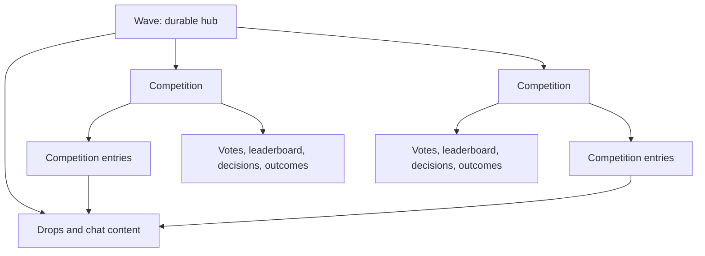

# Waves as Multi-Competition Hubs

## Status

This is the master technical roadmap for separating competitions from waves.
It records shipped functionality, remaining architecture work and acceptance
gates. The [2026-10-01 production assessment](./native-delivery/production-status-2026-10-01.md)
records the dated native-release evidence: the native foundation, context, creation,
runtime and discovery are in production. Existing competitions still use the
legacy engine. The Phase 5 migration tooling is now implemented for delivery
Phase 2 review; no production migration or retirement has occurred. See the
[current migration evidence](./native-delivery/legacy-migration-delivery.md).

The [default-competition experience](./default-competition.md) merged and its
frontend production deployment succeeded on 2026-10-02; the linked delivery
evidence records the separate production E2E failure and its scope. It is a Phase 6 follow-up shipped during coexistence.
Use the [decision register](./phase-0/decision-register.md) for current product
policy and the [Phase 0 package](./phase-0/README.md) for the frozen baseline.

## How to Use This Roadmap

Phase numbers describe dependencies, not a claim that every release followed
strict numerical order: discovery and activation from Phase 6 shipped with
Phases 2–4, before legacy migration. A phase is complete only when all of its
exit criteria are satisfied and its evidence is recorded. Track shipped scope
separately from acceptance still open; production deployment alone is not
proof of migration readiness.

Roadmap phases are architecture milestones. They are distinct from the
repository's delivery workflow terminology:

- Delivery Phase 1 means implementing and validating locally.
- Delivery Phase 2 adds pull requests and review/check completion.
- Delivery Phase 3 adds staging deployment and validation.
- Delivery Phase 4 adds production promotion after the required staging gates.
  The existing release automation owns release notes.

For example, “roadmap Phase 2 to delivery Phase 3” means completing the
frontend-context milestone and taking that work through staging.

## Goal

A wave becomes a durable discussion hub that can host zero, one, or many
competitions over its lifetime. Competitions may run sequentially or in
parallel without creating separate chat destinations or consuming each other's
voting budgets.

The migration must preserve current waves, current competition results, old
client behavior, and uninterrupted chat, voting, decision, and winner flows.
Every GET API contract available to external clients at the Phase 0 baseline
remains backwards compatible permanently, even after its data is served from
the native competition model.

## Legacy Constraint

At the Phase 0 baseline, the wave was both the discussion container and the
competition aggregate. These dependencies remain for legacy competitions:

- Competition type and configuration are stored on the wave.
- Legacy Rank/Approve creation carries participation, voting and outcomes.
- Submissions and winners are represented through drop types.
- Votes, leaderboards, pauses, outcomes, and decisions are keyed by wave.
- Original-primary frontend views retain wave-scoped navigation and timers.
- Some privileged flows infer competition meaning from special wave IDs.

The native path now uses competition identity for submission, voting, execution
and special integrations. Phase 5 migrates the remaining legacy records and
clients; Phase 7 removes obsolete internal coupling once compatibility holds.

## Target Domain

```mermaid
graph TD
    W["Wave: durable hub"] --> C1["Competition"]
    W --> C2["Competition"]
    W --> D["Drops and chat content"]
    C1 --> E1["Competition entries"]
    C2 --> E2["Competition entries"]
    E1 --> D
    E2 --> D
    C1 --> R1["Votes, leaderboard, decisions, outcomes"]
    C2 --> R2["Votes, leaderboard, decisions, outcomes"]
```

### Wave

The wave owns durable hub concerns:

- Identity, name, description, picture, creator, and timestamps.
- Visibility and membership context.
- Wave administrators.
- Chat configuration, moderation, and slow mode.
- Parent/subwave relationships.
- Following, muting, REP, scoring, pinned content, and aggregate activity.

### Competition

The competition owns the rules and lifecycle of one contest:

- Stable ID and owning `wave_id`.
- Type: `RANK` or `APPROVE`.
- Title, description, and presentation settings.
- Participation group, limits, requirements, terms, and signature policy.
- Voting group, credit policy, limits, thresholds, and signature policy.
- Participation, voting, and decision timing.
- Winner limits, decision strategy, outcomes, and distributions.
- Pauses, next-decision state, and configuration version.
- Stored lifecycle and audit information.
- Optional system capabilities for privileged competitions.

`CHAT` is not a competition type in the target model. Chat is a wave
capability.

Stored lifecycle values include `DRAFT`, `PUBLISHED`, `ENDED`, `CANCELLED`,
and `ARCHIVED`; retaining an enum does not expose a manual end/cancel command.
User-facing phases such as upcoming, submissions
open, voting open, deciding, and completed should be derived from lifecycle and
dates.

### Competition Entry

A competition entry connects stable wave content to one competition:

- Stable entry ID.
- `competition_id` and `drop_id`.
- Submitter and submission timestamp.
- Entry status and winner history; deletion follows existing drop permissions,
  with removed content excluded from public entry/history views.
- Winning timestamp, rank, and decision reference where applicable.
- Configuration/signature version needed to validate the submission.

Winning changes the entry, not the drop. Native submission creates a dedicated
competition drop, immutable even when unsigned. A drop belongs to at most one
competition across its lifetime; existing chat drops cannot be attached. There
are no withdrawal/disqualification actions. Future reuse would require a new
product decision, not merely enabling an old proposal.

### Competition-Owned Records

Native votes, vote-credit spending, leaderboard rows, voter state, pauses,
decisions, winners, outcomes, distributions, and historical snapshots are
keyed by `competition_id` and, where relevant, `competition_entry_id`.

The current wave-scoped voting credit meaning maps to a competition-scoped
budget. Parallel competitions must not consume each other's credits. A future
cross-competition budget would be a separate, explicitly named policy.

## Compatibility Architecture

Use a strangler migration with one competition interface and two storage
implementations.

### Legacy Adapter

Every existing non-chat wave is exposed through the new API as having exactly
one stable legacy competition. The adapter continues to use the existing wave,
drop, vote, leaderboard, decision, pause, and outcome records until that
competition is migrated.

Legacy chat waves expose no competition.

### Native Repository

New competitions use additive competition, entry, voting, leaderboard,
decision, pause, and outcome storage. Native records do not require immediate
rewriting of legacy history.

### Compatibility Rules

- Existing `RANK` and `APPROVE` waves retain their permanent API projection and
  familiar single-competition experience. The approved UI default policy may
  select a different competition after others are added, without changing APIs.
- Existing clients continue to see the legacy wave projection permanently.
- A new multi-competition hub projects as chat-only to legacy clients.
- A legacy response must never select an arbitrary “active competition.”
- New responses carry stable competition and entry IDs.
- Websocket and notification payloads retain `wave_id` and add optional
  `competition_id` and `competition_entry_id`.
- Each competition has one declared storage/execution mode so legacy and native
  workers cannot both finalize it.
- Schema removal is allowed only after the permanent GET façade can produce the
  frozen contract entirely from retained/native data.

### Permanent Public GET Guarantee

Phase 0 records every GET endpoint available to external clients, including its
path, parameters, authorization behavior, status codes, response shape,
required/null fields, pagination, ordering, and error semantics. That inventory
is a permanent compatibility manifest.

For those GET contracts:

- Paths and accepted request parameters remain available indefinitely.
- Existing successful and error responses remain wire-compatible.
- Existing `RANK` and `APPROVE` waves receive an immutable
  `legacy_primary_competition_id`.
- Wave-scoped legacy competition reads always project that original primary
  competition, even after the wave gains additional competitions.
- They never switch to the newest, active, or otherwise selected competition.
- Entry/submission/winner fields in legacy drop responses are projected relative
  to the original primary competition.
- A new native hub with no legacy primary competition returns a contract-valid
  chat-wave projection. Its new competitions are intentionally undiscoverable
  through legacy GETs.
- The compatibility façade may read native tables, archived history, or
  purpose-built read models, but external behavior does not depend on the old
  physical schema remaining in use.
- Contract fixtures and regression tests remain in CI after migration work is
  complete.

Permanent compatibility does not make new multi-competition functionality
available to old clients. It guarantees that capabilities and resources they
already understand continue to work. Mutation APIs have a separate support
policy; this permanent guarantee applies to GET APIs.

## Product Defaults for the First Native Release

- Competition visibility inherits from the wave.
- Wave administrators manage competitions.
- Participation and voting groups remain competition-specific.
- Voting credits are isolated per competition.
- Sequential and parallel competitions are supported.
- Competition entries remain visible as stable drops in the hub with explicit
  competition context.
- Submission creates one dedicated immutable competition drop; chat cannot be
  converted into an entry and a drop cannot be reused in another competition.
- Only winner notifications are emitted for competition lifecycle events;
  ordinary mention/reply delivery remains supported.
- Presentation and participation/voting access groups remain editable with an
  audited config version. Credit, signature, submission, timing and decision
  rules freeze after the first accepted entry.
- Published competitions finish through configured rules; manual end/cancel
  and entry withdrawal/disqualification are not exposed. Drafts/terminal
  competitions can be archived and terminal configurations cloned.
- Subwaves remain separate discussion destinations and are not used as
  permanent competition containers.

These defaults reflect the shipped product decisions. Amendments belong in the
decision register. The additional approved [default competition](./default-competition.md)
selects the wave landing competition: one eligible; otherwise earliest-starting active;
otherwise soonest upcoming; otherwise most recently ended. Paused decisions
still count as active, drafts are excluded, and archived completed competitions
remain eligible for the ended fallback. This navigation work is merged and its
frontend is deployed; the linked delivery evidence records a separate production
E2E failure.

## Cross-Phase Engineering Rules

### Additive and Reversible

- Add new tables, columns, API fields, and event fields before using them.
- Do not reinterpret existing rows in place while old readers are active.
- Keep legacy data available until native results have passed parity checks.
- Use feature flags and per-competition execution modes for rollback.
- Make data migrations idempotent, checkpointed, observable, and restartable.

### API and Schema

- Define backend APIs OpenAPI-first and regenerate clients.
- Do not hand-edit generated frontend API models.
- Keep every current public GET endpoint and its frozen contract permanently.
- Treat legacy GET routes as a supported façade, not a temporary migration
  shim.
- Use competition-scoped endpoints for entries, votes, leaderboards,
  decisions, outcomes, voters, and pauses.
- Include configuration version in signed competition actions so signatures
  cannot be replayed against another competition or incompatible rules.

### Frontend State

- Wave state and competition state have separate providers and cache keys.
- Competition selection is keyed by `(wave_id, competition_id)`.
- URLs identify the selected competition for sharing and reload safety.
- Loading, empty, error, cancelled, ended, and parallel-competition states are
  designed explicitly for desktop and mobile.

### Execution Safety

- Decision and leaderboard workers must understand a storage mode before a
  competition can enter it.
- Unique execution keys prevent duplicate decisions, winners, distributions,
  claims, and announcements.
- Decision retries are idempotent.
- Special minting or claims capabilities are attached to a designated
  competition, not inferred only from wave ID.

### Observability

Metrics and logs should be segmentable by:

- Wave ID and competition ID.
- Legacy or native storage mode.
- Worker and API version.
- Competition lifecycle and computed phase.
- Decision lag and retry count.
- Parity result and mismatch category.

Alerts must cover duplicate decisions, delayed decisions, vote-total
mismatches, entry-eligibility mismatches, backfill failures, and unexpected old
endpoint behavior.

## Zero-Downtime Deployment Pattern

For any phase that activates native storage or behavior, deploy in this order:

1. Additive database schema and migration support.
2. Background workers that understand both models, with native work disabled.
3. Backend APIs and compatibility reads, with native writes disabled.
4. Backfills and shadow comparisons where required.
5. Frontend support for legacy and native models.
6. Cohort-based feature enablement.
7. Per-competition execution cutover after all required workers are live.

When a change spans both repositories, backend compatibility must be fully
deployed before the dependent frontend is merged or deployed. New native
competitions must never become executable while any required decision,
leaderboard, notification, or claim worker is unaware of them.

## Roadmap

Use `Not started`, `In progress`, `Blocked`, or `Complete` for phase status.
Update this table and the phase's tracking section together.

| Phase                                          | Milestone                             | Status      | Shipped scope / remaining work                                                                                                                                                                                |
| ---------------------------------------------- | ------------------------------------- | ----------- | ------------------------------------------------------------------------------------------------------------------------------------------------------------------------------------------------------------- |
| [0](./phase-0-contract-and-baseline.md)        | Contract and baseline                 | Complete    | Frozen baseline retained; product decisions amended to match the release and approved default selection.                                                                                                      |
| [1](./phase-1-additive-backend-foundation.md)  | Additive backend foundation           | In progress | Shipped, including independent credit comparison; production parity/performance acceptance still open.                                                                                                        |
| [2](./phase-2-frontend-competition-context.md) | Frontend competition context          | In progress | Routes, scoped context and native views shipped; original-primary path retained and default navigation shipped; final acceptance remains.                                                                     |
| [3](./phase-3-separate-creation-flows.md)      | Separate hub and competition creation | In progress | Hub/draft/publication/admin flows shipped; original shortcut requirement and final product/device acceptance remain open.                                                                                     |
| [4](./phase-4-native-competition-runtime.md)   | Native competition execution          | In progress | Rank/Approve runtime shipped and enabled; production-native completion/observability evidence and migration compatibility remain open.                                                                        |
| [5](./phase-5-legacy-data-migration.md)        | Legacy data migration                 | In progress | Migration tooling implemented under delivery Phase 2 review; production lifecycle/SLO evidence and one-at-a-time migration acceptance remain pending.                                                         |
| [6](./phase-6-progressive-rollout.md)          | Progressive rollout                   | In progress | Discovery/creation enabled in production; default competition is merged with frontend deployment and separate production E2E failure tracked in delivery evidence; rollout/monitoring closeout is still open. |
| [7](./phase-7-retire-wave-coupling.md)         | Retire internal legacy coupling       | Not started | Legacy creation, execution and storage remain; permanent GET contracts survive retirement.                                                                                                                    |

Use the [production assessment and open gates](./native-delivery/production-status-2026-10-01.md)
for current status, the [native implementation record](./native-delivery/implementation-evidence.md)
for implementation details, and the dated [foundation record](./phase-1/implementation-evidence.md)
for historical local evidence. Earlier pending-deployment/credit-gap statements
in historical records are superseded by the production assessment.

The next product follow-up is [default competition](./default-competition.md).
The next migration project is Phase 5; engineering can begin before all
operational evidence is collected, but production cutover cannot. Complete
low-risk completed cohorts first and Main Stage/privileged competitions last.

## Global Success Criteria

The roadmap is complete when:

- A wave can exist indefinitely without a competition.
- A wave can run multiple sequential or parallel competitions.
- Entering a wave and its competition tabs resolves the approved default,
  while explicit competition links and selections retain their own context.
- Chat history and drop identity remain stable across competition lifecycles.
- Voting budgets, eligibility, leaderboards, decisions, and outcomes are
  isolated per competition.
- Current waves retain correct submissions, votes, winners, outcomes, and
  privileged integrations.
- External clients using any current GET API continue working without changes.
- Existing wave-scoped GETs permanently project the wave's immutable original
  competition, while new hub competitions remain available only through new
  APIs.
- No competition can be processed simultaneously by legacy and native engines.
- Native behavior has passed parity, staging, production-cohort, and
  observability gates.
- Legacy wave competition storage and execution paths are no longer required;
  the permanent GET façade is served from native/retained read data.

## Decisions That Must Be Recorded

Maintain resolved decisions in this master document or a linked decision
record. At minimum, record:

- Dedicated entry content, immutability, deletion and the one-competition-per-drop rule.
- How competition submissions appear in the shared chat timeline.
- Competition notification defaults.
- Which published competition fields remain editable.
- The public URL structure for competition detail.
- Rules for automatic completion, archiving and cloning; manual end/cancel and
  reopening remain unavailable.
- Default competition selection and its separation from the legacy primary.
- How special competitions receive minting, claims, curation, quorum, or other
  system capabilities.
- The exact manifest of GET APIs currently available to external clients and
  therefore covered by the permanent compatibility guarantee.
