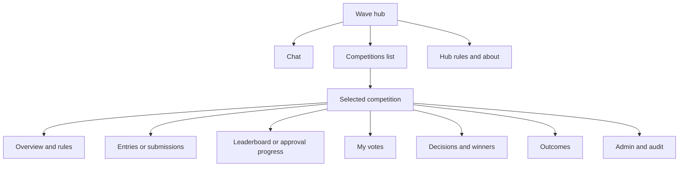
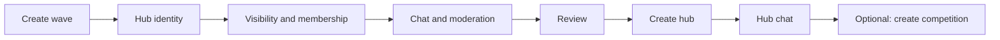
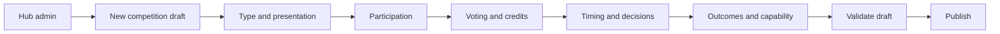

# UX and Information Architecture Proposal

## Information Architecture

The wave is the durable destination. Chat, membership, visibility, moderation,
followers, hub rules, and aggregate activity remain at `/waves/{wave_id}`.
Competitions are selectable resources within that destination, not subwaves.

Canonical routes:

- hub: `/waves/{wave_id}`;
- competition: `/waves/{wave_id}/competitions/{competition_id}`;
- competition tab: `?tab=entries|leaderboard|votes|decisions|outcomes|rules`;
- entry focus: `?entry={competition_entry_id}`;
- existing wave/drop/serial routes remain accepted and do not require a
  competition ID.

The URL is the source of truth for selection. Stored preferences may restore a
tab for `(wave_id, competition_id)` but never redirect a shared URL to another
competition. Unauthorized or invalid IDs are masked and return safely to the
hub without revealing the resource.

## Separate Creation Journeys

### Create a hub without a competition

The hub succeeds independently. If description-drop or metadata follow-up
fails, the UI shows a recoverable partial-success state with the created hub
link. It never deletes the hub automatically.

### Create the first or another competition

Creating a second competition uses the same flow. The review step explicitly
shows overlaps with published competitions and states that parallel credit
budgets are independent. “Start after competition X” is a scheduling helper,
not a parent relationship; saved dates are explicit.

Drafts autosave with visible saved/error state and config version. Publish is
an explicit command after server validation. Capability controls are visible
only to authorized operators, with confirmation and uniqueness validation.

## Zero, One, and Many Competitions

| Count/state | Member experience | Admin experience |
| --- | --- | --- |
| Zero | Competitions tab has an explanatory empty state; chat remains primary. | “Create competition” CTA; draft list if any. |
| One published | Summary card in hub; selecting it opens explicit competition route. No invisible redirect is required. | Edit allowed fields, pause/end/cancel, audit/version access. |
| Many sequential | Group by `Upcoming`, `Active`, and `Completed`; default list order is explicit and stable. | Clone terminal config or schedule new draft; overlap warning. |
| Many parallel | Each active card has own type, phase, timer, entry count, and viewer eligibility; no single global active banner. | Independent controls and credit summaries; actions name the target competition. |
| Drafts | Hidden from ordinary members. | Dedicated draft section with validation blockers and last-saved version. |
| Cancelled/archived | Direct links remain read-only. Default history placement is the deferred D-17 presentation choice. | Audit/reason visible; clone allowed; reopen absent. |

If there is only one competition, components may reduce visual chrome, but
state, URL, cache keys, signatures, and API requests still include its ID.

## Competition Detail States

- **Draft:** admin-only preview, validation issues, unsaved/save-failed state,
  no member entries/votes.
- **Upcoming:** rules and start time; entry/vote actions disabled with reason.
- **Participation open:** entry CTA based on eligibility and first-release
  one-active-entry restriction.
- **Voting open:** entry list/leaderboard plus isolated remaining credit.
- **Paused:** persistent reason/time banner; timers and available actions match
  server state.
- **Deciding:** prior data remains readable; duplicate action submission is
  prevented while execution status refreshes.
- **Completed/ended:** read-only entries, decisions, winners, outcomes, and
  distributions.
- **Cancelled:** read-only entries/votes/audit; no winners or implied refund;
  clone, not reopen.
- **Archived:** direct read remains; return path to hub is explicit.

## Entry and Drop Navigation

An entry card links to its competition detail with `entry` focus. A chat drop
may display zero, one, or several competition badges only when the viewer can
read those competitions. Selecting a badge changes competition context without
changing drop identity.

An old drop link first renders the current drop contract. If the current client
can discover native entries, it may offer context links. It must not choose the
first entry automatically when several exist. Replies, reactions, mentions,
and serial links remain wave/chat navigation.

## Desktop

- Left/primary hub navigation keeps chat and competitions at peer level.
- Competition list/detail can use master-detail at wide widths: status-grouped
  cards left, selected resource right.
- Competition tabs live inside the selected detail, not the global wave tab
  preference.
- Parallel competition cards show compact phase/timer, never a combined timer.
- Admin drafts and audit are separated from member-facing active/history lists.

## Mobile

- Hub header provides `Chat` and `Competitions` destinations.
- Competition list is a full-height view or sheet; selecting opens a
  full-screen detail with an explicit back-to-competitions action.
- Detail tabs use an accessible horizontal list or overflow menu and preserve
  the canonical URL.
- Entry/vote CTAs remain sticky only when enabled; safe-area and keyboard
  behavior cannot obscure errors or confirmation.
- Parallel cards favor phase, deadline, type, and eligibility over verbose
  rules; detail contains the full specification.

Desktop and mobile use the same resource IDs, query keys, permissions, and
server-computed phases. Responsive layout cannot alter selected competition or
credit calculation.

## Failure and Recovery States

| Failure | Required behavior |
| --- | --- |
| Hub list succeeds, competition list fails | Keep chat usable; show scoped retry in competitions surface. |
| List succeeds, detail fails | Preserve route and list; retry detail; masked 404 offers return to hub. |
| Draft save conflict | Show newer config version, diff/reload choice; never overwrite silently. |
| Publish validation fails | Keep draft; map server field/global errors; no partial publication. |
| Entry drop created but association fails | Atomic command should prevent this. If legacy fallback creates partial state, show the ordinary drop and explicit retry/support state; never duplicate it. |
| Vote timeout/duplicate response | Reconcile by idempotency key and refetch voter/leaderboard state before retry. |
| Websocket gap/out-of-order event | Deduplicate/version-check then refetch precise competition resources. |
| Competition ends/cancels while form open | Server rejects with 409; UI preserves input locally, shows terminal state, and disables resubmit. |
| Permission revoked | Clear admin/draft caches, mask protected detail, retain public hub state. |
| Offline/reload | Route retains IDs; cached data is marked stale; actions wait for confirmed connectivity. |
| Unsupported old client on native hub | Legacy GETs render chat; ambiguous legacy competition mutations fail safely. |

## Accessibility and Content Rules

Status never relies on color alone. Timers have stable accessible labels and do
not announce every second. All lifecycle actions name the competition and
require confirmation for publish, cancel, end, archive, disqualify, and
privileged capability assignment. Empty/error states distinguish “no
competitions,” “not authorized,” and “failed to load” without leaking private
resources.

## Validation Scenarios

Responsive tests cover zero, one, sequential many, parallel many, draft,
paused, ended, cancelled, archived, unauthorized, not found, network failure,
save conflict, old wave/drop deep links, entry focus, reload, and back/forward
navigation. Main Stage is tested as a competition capability, including a
non-capability competition in the same wave to catch wave-ID inference.
