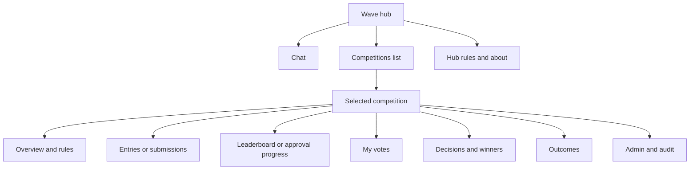
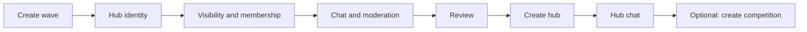
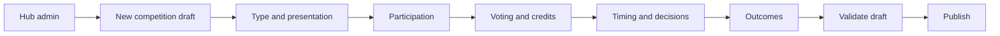

# UX and Information Architecture Proposal

This design guidance incorporates the amended product decisions. Shipped scope
and unverified acceptance are tracked in the [production assessment](../native-delivery/production-status-2026-10-01.md).
Automatic default selection below is approved but not implemented; other layout
suggestions are design guidance, not evidence that every proposed control exists.

## Information Architecture

The wave is the durable destination. Chat, membership, visibility, moderation,
followers, hub rules, and aggregate activity remain at `/waves/{wave_id}`.
Competitions are selectable resources within that destination, not subwaves.

```mermaid
graph TD
    W["Wave hub"] --> CH["Chat"]
    W --> CL["Competitions list"]
    W --> HR["Hub rules and about"]
    CL --> C["Selected competition"]
    C --> OV["Overview and rules"]
    C --> EN["Entries or submissions"]
    C --> LB["Leaderboard or approval progress"]
    C --> MV["My votes"]
    C --> DE["Decisions and winners"]
    C --> OU["Outcomes"]
    C --> AD["Admin and audit"]
```

Canonical routes:

- hub: `/waves/{wave_id}`;
- competition: `/waves/{wave_id}/competitions/{competition_id}`;
- competition tab: `?tab=entries|leaderboard|votes|decisions|outcomes|rules`;
- entry focus: `?entry={competition_entry_id}`;
- existing wave/drop/serial routes remain accepted and do not require a
  competition ID.

The URL is the source of truth for selection. Stored preferences may restore a
tab for `(wave_id, competition_id)` but never redirect a shared URL to another
competition. Unauthorized or invalid IDs are masked and return safely to the
hub without revealing the resource.

## Default Competition (Approved Follow-Up)

Entering a wave without an explicit destination must stay in Chat. Its
[default competition](../default-competition.md) supplies wave competition tabs
opening that competition's leaderboard, winners and corresponding views.
One eligible competition wins; otherwise choose the earliest-starting active;
with none active choose the soonest upcoming, otherwise the most recently ended.
Decision pauses count as active, drafts are excluded, and archived completed
competitions remain eligible for the historical fallback. Keep explicit routes,
shared chat and immutable legacy GET projection independent of this UI default.

## Separate Creation Journeys

### Create a hub without a competition

```mermaid
flowchart LR
    A["Create wave"] --> B["Hub identity"]
    B --> C["Visibility and membership"]
    C --> D["Chat and moderation"]
    D --> E["Review"]
    E --> F["Create hub"]
    F --> G["Hub chat"]
    G --> H["Optional: create competition"]
```

The hub succeeds independently. If description-drop or metadata follow-up
fails, the UI shows a recoverable partial-success state with the created hub
link. It never deletes the hub automatically.

### Create the first or another competition

```mermaid
flowchart LR
    A["Hub admin"] --> B["New competition draft"]
    B --> C["Type and presentation"]
    C --> D["Participation"]
    D --> E["Voting and credits"]
    E --> F["Timing and decisions"]
    F --> G["Outcomes"]
    G --> H["Validate draft"]
    H --> I["Publish"]
```

Creating a second competition uses the same flow. The review step explicitly
shows overlaps with published competitions and states that parallel credit
budgets are independent. “Start after competition X” is a scheduling helper,
not a parent relationship; saved dates are explicit.

Drafts autosave with visible saved/error state and config version. Publish is
an explicit command after server validation. Privileged capability assignment
is a separate audited operations action, not an ordinary wizard control.

## Zero, One, and Many Competitions

| Count/state | Member experience | Admin experience |
| --- | --- | --- |
| Zero | Competitions tab has an explanatory empty state; chat remains primary. | “Create competition” CTA; draft list if any. |
| One eligible | Approved follow-up: it is the wave default and competition tabs open its views. Explicit detail route remains available. | Edit allowed fields, pause/resume decisions, audit/version access. |
| Many sequential | Group by `Upcoming`, `Active`, and `Completed`; default list order is explicit and stable. | Clone terminal config or schedule new draft; overlap warning. |
| Many parallel | Approved default is the earliest-starting active competition; discovery exposes all with their own phase/timer/eligibility. | Independent controls and credit summaries; actions name the target competition. |
| Drafts | Hidden from ordinary members. | Dedicated draft section with validation blockers and last-saved version. |
| Archived completed | Direct links/history remain available; eligible for the most-recently-ended default fallback. Archived drafts stay excluded. | Audit visible; terminal clone allowed; reopen absent. |

If there is only one competition, components may reduce visual chrome, but
state, URL, cache keys, signatures, and API requests still include its ID.

## Competition Detail States

- **Draft:** admin-only preview, validation issues, unsaved/save-failed state,
  no member entries/votes.
- **Upcoming:** rules and start time; entry/vote actions disabled with reason.
- **Participation open:** entry CTA based on eligibility and first-release
  one-competition-per-drop lifetime restriction.
- **Voting open:** entry list/leaderboard plus isolated remaining credit.
- **Paused:** persistent reason/time banner; timers and available actions match
  server state. Pausing decisions does not by itself remove active status for
  default selection.
- **Deciding:** prior data remains readable; duplicate action submission is
  prevented while execution status refreshes.
- **Completed/ended:** read-only entries, decisions, winners, outcomes, and
  distributions.
- **Cancelled:** retained compatibility state only; no manual cancellation
  feature is implied.
- **Archived:** direct read remains; return path to hub is explicit.

## Entry and Drop Navigation

An entry card links to its competition detail with `entry` focus. Dedicated
competition drops expose their one authorized competition context in shared
wave content. Ordinary chat drops are not entries and cannot be attached.
Selecting entry context preserves drop identity.

An old drop link first renders the current drop contract. If the current client
can discover a native entry, it may offer its authorized context link. Default
selection never overrides that explicit entry context. Replies, reactions, mentions,
and serial links remain wave/chat navigation.

## Desktop

- Left/primary hub navigation keeps chat and competitions at peer level.
- Competition list/detail can use master-detail at wide widths: status-grouped
  cards left, selected resource right.
- Competition tabs use explicit selected context or the resolved wave default;
  a global wave-tab preference must not leak state between competitions.
- Parallel competition cards show compact phase/timer, never a combined timer.
- Admin drafts and audit are separated from member-facing active/history lists.

## Mobile

- Hub header retains `Chat` and `Competitions` discovery; the approved follow-up
  exposes familiar competition views scoped to the resolved default.
- Competition list is a full-height view or sheet; selecting opens a
  full-screen detail with an explicit back-to-competitions action.
- Detail tabs use an accessible horizontal list or overflow menu and preserve
  the canonical URL.
- Entry/vote CTAs remain sticky only when enabled; safe-area and keyboard
  behavior cannot obscure errors or confirmation.
- Parallel cards favor phase, deadline, type, and eligibility over verbose
  rules; detail contains the full specification.

Desktop and mobile use the same resource IDs, query keys, permissions, and
server-computed phases. Responsive layout cannot alter selected competition or
credit calculation.

## Failure and Recovery States

| Failure | Required behavior |
| --- | --- |
| Hub list succeeds, competition list fails | Keep chat usable; show scoped retry in competitions surface. |
| List succeeds, detail fails | Preserve route and list; retry detail; masked 404 offers return to hub. |
| Draft save conflict | Show newer config version, diff/reload choice; never overwrite silently. |
| Publish validation fails | Keep draft; map server field/global errors; no partial publication. |
| Entry drop created but association fails | Atomic command should prevent this. No native fallback attaches a chat drop. Reconcile the atomic command by idempotency key; never duplicate it. |
| Vote timeout/duplicate response | Reconcile by idempotency key and refetch voter/leaderboard state before retry. |
| Websocket gap/out-of-order event | Deduplicate/version-check then refetch precise competition resources. |
| Competition completes while form open | Server rejects with 409; UI preserves input locally, shows terminal state, and disables resubmit. |
| Permission revoked | Clear admin/draft caches, mask protected detail, retain public hub state. |
| Offline/reload | Route retains IDs; cached data is marked stale; actions wait for confirmed connectivity. |
| Unsupported old client on native hub | Legacy GETs render chat; ambiguous legacy competition mutations fail safely. |

## Accessibility and Content Rules

Status never relies on color alone. Timers have stable accessible labels and do
not announce every second. All lifecycle actions name the competition and
make publication, archive and operations capability consequences clear.
Manual end/cancel and entry withdrawal/disqualification are not exposed. Empty/error states distinguish “no
competitions,” “not authorized,” and “failed to load” without leaking private
resources.

## Validation Scenarios

Responsive tests cover zero, one, sequential many, parallel many, draft,
paused, ended, cancelled, archived, unauthorized, not found, network failure,
save conflict, old wave/drop deep links, entry focus, reload, and back/forward
navigation. Main Stage is tested as a competition capability, including a
non-capability competition in the same wave to catch wave-ID inference. Add
the full [default-selection acceptance matrix](../default-competition.md#acceptance-scenarios),
including explicit selection, paused active contests and archived completed history.
