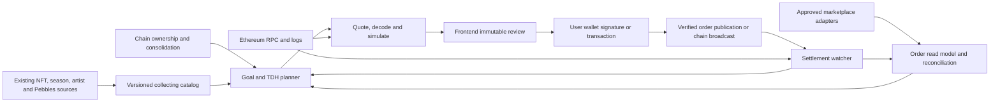

# Backend specification

## 1. Architecture and ownership

Use the existing Express API, MySQL, Redis, queue/worker deployment model and chain ingestion. Extend the collection domain rather than replace its source of truth. Existing market-stat workers reduce marketplace responses to indicative prices and update Memes every 10 minutes and Gradients/NextGen every 30 minutes in the checked configuration. Preserve their analytics role. Add an independent order lifecycle and execution subsystem; a faster floor-price job is insufficient.



Initial modules: `collectingCatalog`, `collectingGoals`, `collectingPlanner`, `marketOrders`, `marketQuotes`, `marketOperations`, `marketProviderAdapters`, and `tdhProjection`. Names are proposals. An adapter supplies market data and unsigned execution material; 6529 owns authorization checks, decoding, planning, snapshots, exposure and outcome reconciliation.

Do not give the API access to users' private keys. All normal trading is user-signed. A future automation executor is a distinct capability and service, not a privilege added to profile auth or the subscription worker.

## 2. Canonical domain model

Use integer-string quantities and amounts at API boundaries. Asset token IDs may exceed JavaScript safe integer range. Store uint256 identifiers/amounts losslessly, for example validated decimal strings in `VARCHAR(78)` or binary uint256; [MySQL DECIMAL supports at most 65 digits](https://dev.mysql.com/doc/refman/8.4/en/fixed-point-types.html) and cannot represent the full uint256 range. Fixed-width big-endian binary supports ordering, or use a validated bounded numeric domain where proven. No executable monetary amount uses FLOAT/DOUBLE.

| Entity | Required contents and constraints |
|---|---|
| Asset / collection registry | Chain, contract, standard, verified family, NextGen collection ID, token ID, onchain versus normalized display ID, availability flags, approved media source. Only canonical mainnet families in v1. |
| Catalog version | Catalog/membership hash, indexed block and hash, metadata revision, publication time, immutable explicit target requirements and provenance. |
| Artist / work graph | Stable artist IDs, aliases, verified profile links, collaboration edges, work IDs and curation provenance. Existing artist-name splitting remains display input, not authority. |
| Requirement definition | Kind, catalog version, exact token quantities or `(facet,value)` requirements with eligible token alternatives, completion semantics, ownership scope and cutoff. |
| Holdings snapshot | Per raw wallet/asset balances, chain block/hash, acquisition-lot history references, confirmed consolidation graph/version, completeness status; pending transfers separate. |
| Goal | Owner/auth principal, stable target profile/collector ID, private visibility, requirement definition/version, target quantity, confirmed membership snapshot, receive wallet, objective, locks/exclusions, budget/deadline, definition revision. |
| Plan revision | Immutable goal revision, holdings/catalog/rules snapshots, market coverage, candidate/selected order legs, satisfied/missing/unavailable requirements, algorithm status and assumptions. |
| Market order | `(chain, protocol, orderHash)` unique identity, provider aliases, maker, side, signed asset/currency/fee terms, order type, zone/conduit, start/expiry/counter, original and remaining fraction/quantity, raw payload reference. |
| Quote | Plan/order revision, maker/payer/recipient, exact quantity, amounts, cost limits, approvals, action envelope/calldata digest, simulation block, venue timestamps, expiry and quote digest. |
| Operation / step | Auth principal and actual wallet, idempotency key/body hash, quote/intent binding, typed step, wallet submission references, chain nonce/hash or Safe proposal ID, current lifecycle and durable events. |
| Exposure reservation | Wallet/currency, goal/asset quantity, associated order/operation, maximum economic liability, gas reserve, state and verified release reason. Internal accounting, not escrow. |
| Settlement/event journal | Unique chain/blockHash/txHash/logIndex, order linkage, exact transfers, fees, quantities, finality and reorg status. Append-only corrections and retractions. |
| Automation policy (later) | Immutable typed constraints, version/hash, user authorization proof, onchain enforcement reference, counters, expiry, revocation state and action audit. |

Store provider payloads/signatures separately with access control and redacted logs. Published signatures may be intentionally distributable order material but must never leak into unrelated diagnostics. Private goals and limits require object-level authorization, including websocket events and exported files. Browser wallet auth does not authorize cross-user reads or mutation.

Key indexes: order identity unique; asset/side/validity/price; maker/active state; goal owner/update time; operation wallet/nonce; idempotency principal/operation/key; reservation wallet/currency/state; chain event identity. Normalize duplicate listings seen from multiple providers to the same protocol order, while preserving provenance. Orders from distinct protocols selling the same asset remain competing claims on shared inventory, not additive stock.

## 3. Collection catalog and goal analysis

Derive Meme season members from existing `Type - Season` metadata and indexed NFT records. Materialize explicit IDs; do not infer a season from a fixed count or an unverified numeric interval. Full-set quantity is the minimum across required card balances, using the requested target universe. Distinguish released inventory and the latest TDH-eligible universe. Burned/unminted/pending outputs are not buyable candidates.

Current NextGen scope is Pebbles collection 1 within the verified core contract. The catalog must map true token IDs and existing Palette/Size/Traced values. A trait requirement is covered when at least one held eligible token has that value. Ultimate is the AND of all canonical values in all three facets. One token may satisfy requirements in several facets. Reuse existing derivation and version it; do not turn Ultimate into all pairwise trait combinations.

**All primary set aggregation is account/profile-wide.** Resolve the stable profile/collector identity to its canonical confirmed consolidation key and member wallets through existing identity services. Aggregate holdings before calculating every set type, including Pebbles. Pin profile ID, consolidation key, member-wallet hash/version and holdings snapshot in each plan. A wallet-only view is custody detail, not an alternative primary score. Multiple authenticated accounts, proxies or address-name matches do not merge holdings.

Change `fetchNextGenCollectionTraitSets` and the Ultimate query in `src/api-serverless/src/nextgen/nextgen.db-api.ts` to group by canonical collector identity rather than owner. Resolve owner → `ADDRESS_CONSOLIDATION_KEY` → `IDENTITIES` using the existing identity mapping semantics. `IdentityEntity` is keyed by consolidation key and profile ID can be absent; preserve a deterministic standalone collector identity for unmapped/unprofiled wallets without falsely merging them by handle. Return one collector row with profile, membership snapshot, distinct values and token references containing actual custody wallets. Use the same aggregation for the full page, preview and planner.

Use the active canonical identity record, not every historical row sharing a profile ID. A missing handle is not a missing account. A confirmed anonymous consolidation remains one collector; only a verified unmapped singleton falls back to an address-labeled anonymous collector. Stale/ambiguous mappings make coverage incomplete and block execution planning, rather than silently splitting accounts. Preserve the old `owner` field as custody if retained; do not redefine it to mean profile ID. Introduce explicit generated response fields for `collectorId`, `profileId`, `consolidationKey`, `membershipSnapshot` and per-token `custodyWallet`.

Build mapped unique owned tokens first, join traits on both collection and token IDs, deduplicate `(collector,facet,value)`, then aggregate. Attach identity/TDH display information after coverage aggregation. Fetch token-value arrays in a batched second relation instead of relying on potentially truncated `GROUP_CONCAT` lists. Account-level pagination count and page rows must use the same relation with deterministic coverage/key ordering, including Ultimate. Update the API schema and existing frontend consumers together.

Deduplicate membership and raw ownership before joins to traits or display identities. For Memes, sum valid copies of each card across the profile first, then take required-card minimum for set count. For Pebbles, count distinct `(facet,value)` across the profile's unique owned token IDs; duplicates across wallets cannot inflate coverage. Ultimate requires all canonical values across all selected facets after this aggregation. Do not sum each wallet's completed sets, which misses complementary holdings split across wallets.

Execution still selects one actual payer/maker; listing from several wallets requires separate signatures/batches. Default recipient is a confirmed wallet in the target profile and bind the exact address at review. A recipient outside the target profile requires an explicit different/gift intent and cannot be credited to the original goal. Never move assets between wallets merely to make set completion count. If profile membership changes, invalidate unsigned analysis/quotes and recompute; already signed orders retain their original authority and need separate handling.

Analysis returns each requirement's target, confirmed owned, incoming pending, planned acquisition, active offer exposure and missing quantity. Pending acquisitions block duplicate preparation but do not count as confirmed completion. For exact Meme targets: `deficit = max(0, targetCopies - confirmedOwned)`, then reserve pending intent against planning without falsely marking it acquired. Unknown holdings abort personalized analysis rather than become zero.

## 4. Planner algorithms

### Exact items, seasons and full sets

Expand deficits, then gather executable candidate orders for each exact asset. Enforce each order's remaining fill fraction, maker inventory, shared inventory across listings, divisibility, allowed currency, fee policy, source and recipient. Deduplicate providers. Rank complete candidate routes by total economic debit and bounded transaction overhead; aggregate gas is route-specific, not the sum of floor prices.

For small exact targets, enumerate sensible venue/batch combinations and solve minimum-cost quantities under shared inventory and route constraints. For large sets use bounded optimization with locked choices and clear partial coverage. An unlisted card is a blocker, not an invitation to substitute another card. Return purchase legs and offer/watch suggestions separately. Do not include speculative offer fills in an immediately achievable completion claim.

### Pebbles sets

Use weighted set cover: each listed unique token covers its missing `(facet,value)` requirements; select tokens minimizing total route cost while covering the chosen facet or Ultimate target. A token is purchased at most once and can cover several requirements. Lock user favorites before optimizing the remaining gaps. Show which gaps each selected Pebble closes. If an entire facet value has no buyable token, return that gap explicitly.

Start with an exact bounded solver for small candidate sets and a deterministic heuristic with lower-bound/coverage reporting for larger sets. Do not promise mathematical optimality unless proven within the candidate universe; source coverage and solver optimality are separate dimensions. Tie-break deterministically by total price, transaction count and canonical asset/order key. Record solver version, input hash, duration and termination reason.

### TDH planning

Evaluate portfolio scenarios and candidate bundles, including season/full-set thresholds and relevant Gradient increments. Do not treat independent token rate/price ordering as the full objective. Offer minimum cost for a target TDH difference, maximum difference within budget, or lowest positive cost/difference at the selected horizon. Preserve explicit user-selected art and never silently optimize away their collection goal.

Cheap heuristics may propose promising missing-season bundles, next-set completions, Gradient additions and high-rate exact quantities. The canonical TDH evaluator scores each complete candidate. Return at least the chosen plan and a small number of substantively different alternatives where available. Avoid fictitious fill probability, guaranteed future prices or made-up confidence percentages.

## 5. Exact TDH projection

Extract/share a pure deterministic calculation kernel with production TDH logic only after equivalence tests. Do not alter production TDH rules to simplify shopping. Until a shared kernel exists, replay a faithful isolated evaluator with immutable fixtures and drift checks. A scenario never writes official TDH tables.

Required inputs: all relevant acquisition lots and raw custody; confirmed consolidation at the evaluation snapshot; eligible NFTs, supplies, edition floors and recorded rates; current season/rules configuration; hypothetical acquisitions/sales with assumed timestamps; requested future snapshot and a frozen scenario policy. Preserve the existing two-decimal rate, intermediate/base and per-token boosted rounding. Return the exact rule/input versions and actual snapshot block/time independently of projection time.

Verified rules that must survive extraction:

- The daily cutoff is 00:00 UTC, using the Ethereum block at or before it. Calculation may finish later; show the completed snapshot separately from processing time. Preserve the current one-day post-mint eligibility test for Memes and the evaluator's timestamp semantics.
- Whole-day age comes from transfer-history replay. An external purchase starts a new lot; internal transfers within the confirmed consolidation preserve age. Outgoing editions remove newest lots under current LIFO behavior.
- Zero-day eligible balances can complete a target/boost even while contributing zero holding days. Latest release and TDH eligibility are different snapshots.
- Memes use an effective edition denominator `max(supply, edition_size_floor)` after the evaluator's special supply adjustments; do not substitute current live supply. The ordinary new-card floor comes from claim maximum capped at 310, with existing fallback/legacy rules. Preserve special adjustments and rounding. NextGen uses the stored token `hodl_rate`, not a rate invented from market price.
- Closed eligible seasons have configured bonuses; the highest adjusted season is excluded. Current configuration covers season bonuses through 20, not an indefinite extrapolation.
- With a full eligible collection, apply its eligible-season bonus sum once. Without a full collection, use eligible completed-season bonuses; Genesis/Nakamoto partial S1 bonuses do not stack on a complete S1.
- For `s` full sets, additional-set bonus is `0.05 * (1 - 0.6529^(s-1)) / (1 - 0.6529)` for `s >= 1`. Second total set adds 0.05; third adds another 0.032645 before final rounding. Do not shift the exponent by one.
- Gradients add 0.02 each up to five under current rules. A sixth can contribute holding TDH without adding a Gradient multiplier.
- The resulting portfolio boost applies accumulated Memes, Gradients and NextGen contributions. There is no current Pebbles trait-set or artist-completion boost.

Response: baseline TDH, proposed TDH, difference, base and boosted breakdown per asset/family, changed boost on existing holdings, whole-day timing, required missing sets, assumptions and warnings. Report undefined cost/TDH when difference is nonpositive. Explain projection drift from unknown future mints/rule or supply changes. Never imply current seller TDH transfers to the buyer.

## 6. Provider adapter and executable quote

Recommend first proving current OpenSea API/SDK integration, using its documented unsigned listing/offer action endpoints for server-build → client-sign → server-verify/post. Pin versions after the proof. SDKs and provider keys remain backend-only; examples using a server signer are not authorization to custody user keys. Initial supported forms are exact-token fixed-price orders in ETH/WETH, with no arbitrary currencies, dynamic auctions or custom criteria zones.

Always send explicit quantity, expiry and creator-fee settings. OpenSea listing fulfillment defaults omitted `units_to_fill` to all remaining units. Its current offer-actions defaults include 30-day expiry and optional creator fees off, while listing actions differ. The platform must override defaults to the reviewed intent and verify returned terms. Collection sweep endpoints may substitute another token; never use such defaults for exact collection completion.

BUY/ACCEPT quote pipeline (existing orders):

1. Authenticate private intent and bind actual maker/payer/recipient, chain, requirement version and limits.
2. Fetch the current order and provider fulfillment material; validate the provider schema, order identity and freshness.
3. Independently verify allowlisted chain/contracts/selector/conduit/zone/currency; decode every asset and consideration, fee recipient and amount.
4. Read current owner/balances, approvals, WETH funding, order status/counter/fill fraction, expiry and signature validity. Validate actual quantities; fees must be divisible for partial ERC-1155 fills.
5. Simulate the exact action at a identified recent block with the actual caller, value and recipient. Verify expected asset flows and reject unexplained approvals/transfers or failed reads.
6. Calculate exact trade debit/credit and fee breakdown; estimate gas and propose maximum transaction gas settings separately. Simulated availability is not inventory reservation.
7. Persist an immutable short-lived quote with digest and typed action envelope; return a readable summary derived from that same envelope.
8. Immediately before opening the wallet, refresh critical state. Economic or asset changes produce a new review revision. Some wallets broadcast on approval without another application checkpoint. Quote TTL alone cannot prevent late execution: bind exact economic/asset terms onchain, and require a supported onchain deadline for any hard expiry promise. After order signing, verify maker signature and unchanged terms before publication. Reconcile uncertain publication by the same order hash.

If BUY/ACCEPT first needs an approval, validate and simulate that approval step separately. A prospective final-trade simulation may use explicitly labeled state overrides, but that is not evidence approvals exist. After approval confirms, reread actual state and simulate/review the final trade with a fresh quote.

LIST/OFFER preparation is a different pipeline: construct and decode prospective order terms; check required balances/approvals and simulate any approval/wrap actions; let the user execute those steps; reread state; request the exact order signature; verify signature and economic terms; then publish idempotently. There is no maker signature to validate or actual settlement transaction to simulate before the user has signed a new order. Do not label creation-time checks as a guarantee the order will still be funded or fillable later.

Gas estimate is not a guaranteed charged amount. For a user-submitted transaction, the maximum intended gas cost is gasLimit × maxFeePerGas, with replacement/retry limits stated separately; wallet changes to those settings require updated total review where detectable. Contract-level asset caps do not bound externally paid gas. A budgeted plan includes a conservative gas reserve and refuses a new attempt that exceeds the remaining authorized attempt budget.

## 7. Proposed API contract

Paths are relative to the existing backend API namespace, and all new contracts belong in the backend OpenAPI source. GET is side-effect free. POST preview endpoints can persist short-lived analysis but never sign or trade. Mutation routes use scoped auth, object-level ownership checks, rate limits and idempotency as applicable.

| Endpoint | Purpose / main response |
|---|---|
| `GET /market/capabilities` | Supported chains, contracts, order types, wallets, currencies, venues and temporarily disabled actions. |
| `GET /collect/catalog` | Versioned collections, seasons, artists and Pebbles requirement definitions. |
| `GET /market/assets` | Cursor-paginated browse with executable/indicative distinction, coverage and timestamps. |
| `GET /market/assets/{chain}/{contract}/{token}/orders` | Listings/offers with remaining quantity, currency, fee view, source and validity. |
| `POST /collect/analyses` | Public/profile-scope preview; exact holdings/requirements snapshots, deficits and optional TDH scenario. |
| `POST /collect/goals`, `PATCH /collect/goals/{id}` | Save/edit private definition; revision/If-Match prevents overwriting concurrent edits. |
| `POST /collect/goals/{id}/plans` | Generate immutable plan; return completed result or 202 with job ID. |
| `GET /collect/plans/{id}` | Read analyzed selection, blockers, costs, objective, versions and assumptions. |
| `POST /market/quotes` | Prepare BUY/LIST/OFFER/ACCEPT/CANCEL from exact typed intent; return decoded review and supported wallet steps. |
| `POST /market/orders` | Publish a client-signed order bound to a valid prepared intent after independent validation. |
| `POST /market/operations` | Record reviewed execution intent before wallet launch; returns durable operation ID. |
| `POST /market/operations/{id}/submissions` | Attach transaction hash, user operation or Safe proposal; verify chain/maker/nonce before treating as submitted. |
| `GET /market/operations/{id}` | Per-step state, exact outcomes and reconciliation requirements. |
| `POST /market/orders/{id}/cancellations` | Prepare/record cancellation; never claim immediate onchain finality. |
| `GET /market/me/orders` | Private operational view of known orders/exposure; publication terms themselves may be public. |
| `GET /market/events?cursor=...` | Authenticated durable status stream/poll cursor with gap recovery. |
| `POST /collect/tdh-scenarios` | Bounded read-only deterministic portfolio comparison. |
| `/collect/rules/*` | Later: versioned preview, authorize, pause and revoke; never implicit authority from create/update. |

Example conceptual quote request (addresses/catalog IDs abbreviated here; real API validates exact values):

```json
{
  "intent": "BUY",
  "planId": "plan_123",
  "planRevision": 4,
  "chainId": 1,
  "payer": "<verified wallet address>",
  "recipient": "<reviewed recipient address>",
  "legs": [{"orderId": "order_456", "quantity": "1"}],
  "limits": {"currency": "ETH", "maxTradeAmount": "100000000000000000", "maxGasReserve": "3000000000000000"},
  "fillPolicy": "EXACT_ITEMS_ALLOW_PARTIAL",
  "creatorFeePolicyId": "policy_version_1"
}
```

In the real schema currency is a chain-bound native/ERC20 discriminated identifier; the simplified `ETH` above is illustrative. Required quantity may never be omitted. Atomic mode is a separate enum accepted only by an adapter that proves entire-basket enforcement. `EXACT_ITEMS_ALLOW_PARTIAL` permits missing exact legs, not substitutes.

Quote response requires: `quoteId`, `intentHash`, `expiresAt`, `validatedAtBlock`, `validatedAtBlockHash`, payer/recipient, `assetsIn`, `assetsOut`, itemized fees, exact trade debit/credit, gas estimate/reserve, steps, target/selector/calldata or typed-data digest, expected fills, fill policy, capability version, warnings and required acknowledgments. Each step is a discriminated schema with a closed enum, never arbitrary JSON-RPC.

Standard error codes: `QUOTE_EXPIRED`, `ORDER_UNAVAILABLE`, `QUANTITY_CHANGED`, `PARTIAL_FILL_UNSUPPORTED`, `PRICE_CAP_EXCEEDED`, `INSUFFICIENT_FUNDS`, `ALLOWANCE_REQUIRED`, `WALLET_CANNOT_SIGN`, `WRONG_CHAIN`, `RECIPIENT_SCOPE_MISMATCH`, `CATALOG_CHANGED`, `STALE_HOLDINGS`, `UNSUPPORTED_ZONE`, `SIMULATION_FAILED`, `EXPOSURE_CONFLICT`, `SUBMISSION_UNKNOWN`, `PROVIDER_DEGRADED`. Include retryability and a safe next action; never include secrets/provider raw exceptions.

## 8. Lifecycle, concurrency and budgets

Do not overload one status with provider visibility, fill validity and settlement finality. Track order publication (`draft/signed/publishing/published/unknown`), economic validity (`active/partial/underfunded/invalid/expired/cancel_pending/cancelled/filled`) and transaction state independently. Invalid due to allowance/balance may revive after refunding/reapproval; it is not equivalent to permanently cancelled.

Operations progress through prepared, review, awaiting approval/signature, publishing/submitting, pending, mined, confirmed, indexed. Alternative paths include user rejection, failure, partial completion, replacement, unknown and reorg. Persist events and an outbox in the same transaction as state transitions. Queue retries replay idempotently, not create fresh financial intent.

Use serializable/row-locked reservations for `(wallet,currency)` spending and `(profile,requirement/asset,target revision)` acquisition quantities, with unique operation constraints. Coordinate overlapping goals across different funding wallets so two platform workers cannot independently buy the same final missing requirement; an explicit additional-set target remains valid. Bind idempotency to authenticated principal, action, key and body digest. Same key/body returns the original result; same key/different body returns conflict. Retain deduplication beyond every economically live order and reconciliation window, not just a short HTTP retry TTL. Transaction replacements link to the same economic intent and nonce. These platform locks do not create authority over sibling wallets or prevent unrelated external trades.

Internal remaining budget equals authorized budget minus confirmed economic spend, worst-case pending transaction debits, known live offer liabilities and the reserved attempt/gas allowance. Wraps move ETH into WETH and are not counted again as acquisition principal when WETH later settles; gas for wrapping is counted. Refunds reduce the appropriate pending liability, not create a new lifetime authorization. Failed attempts consume gas even with no NFTs acquired. A separate currency ledger prevents ETH and WETH balances being silently interchangeable.

Recognize refunds only from verified same-operation receipts/asset changes. Seller proceeds, unrelated deposits and transferred-out acquisitions do not replenish a lifetime cap or reopen a completed target unless a separately approved policy explicitly permits that behavior. Track every replacement, cancellation and failed-attempt gas cost against the appropriate attempt budget.

The reservation system coordinates platform tabs/workers. It cannot see every private external signature or prevent external transactions. Display known exposure and its limits. Signed orders that a third party can fill remain economically live during cancellation races, website pauses or logout. Release reservation only on chain-evaluated expiry, confirmed effective order/counter cancellation, finalized fill reconciliation, or a formally proven permanently unfillable route. Temporary lack of balance/approval/ownership, provider rejection/delisting and API quote expiry do not release live signature liability because the order may revive. A signed payload released beyond the trusted signing boundary may be executable even if publication was never acknowledged.

## 9. Indexing, finality and operations

Use provider streams for latency, periodic API reconciliation for orderbook completeness and chain logs for settlement truth. Current OpenSea streams are best-effort and can miss messages during disconnect; reconnect must fetch a current snapshot and replay/deduplicate with chain evidence. Persist provider cursors where supported, but do not assume a stream has replay semantics.

Chain watcher tracks block number/hash and canonical ancestry. Keep receipts as mined/unconfirmed then safe/finalized according to the configured chain policy, with clear UI labels. On reorg, retract affected fills and progress, rebuild reservations and replay from the last common checkpoint. Do not release duplicate protection merely because one RPC temporarily lacks a receipt. Cross-check endpoint disagreements and pause new relevant execution.

A successful transaction is not proof a set completed. Decode actual NFT and currency transfer outcomes and Seaport fill events; attribute partial quantities and actual fees to each leg. Compare observed transfers against reviewed intent, excluding known unrelated logs rather than assuming every event belongs to the order. Alert and pause on unexplained flows. Raw ownership may lag; direct chain verification bridges to ordinary indexing without writing invented holdings.

Proposed workers: order ingestion, order reconciliation, execution watcher, asynchronous planner and later policy runner. Separate queues/limits so large TDH or set-cover tasks cannot starve cancellation or transaction recovery. Register TypeORM entities in `src/entities/entities.ts` and use the existing `dbMigrationsLoop` schema-sync and backend service catalog conventions. Do not introduce a new migration framework or schema-migration scripts without the repository's required justification/authorization. Do not require a new infrastructure platform solely for this feature.

Initial engineering targets, measured before commitment: cached catalog/search p95 ≤500ms; small analysis ≤2s; expensive analysis returns a job immediately and a bounded best-found result around 10s; fresh quote p95 ≤5s or explicit degradation. Correctness wins over these targets. Cap candidate sets, portfolio scopes, quote rate and concurrent wallet operations.

Monitor provider freshness/coverage, stale rejection, actual quote-to-fill outcomes, decode/simulation failures, event lag, reorg recovery, reservation drift, duplicate preparation, solver timeout and TDH fixture drift. Logs contain IDs, hashes and reason codes with sensitive intent fields redacted. Keep a global switch for new quotes/signatures/broadcasts and independently available cancellation/revocation/recovery paths.
