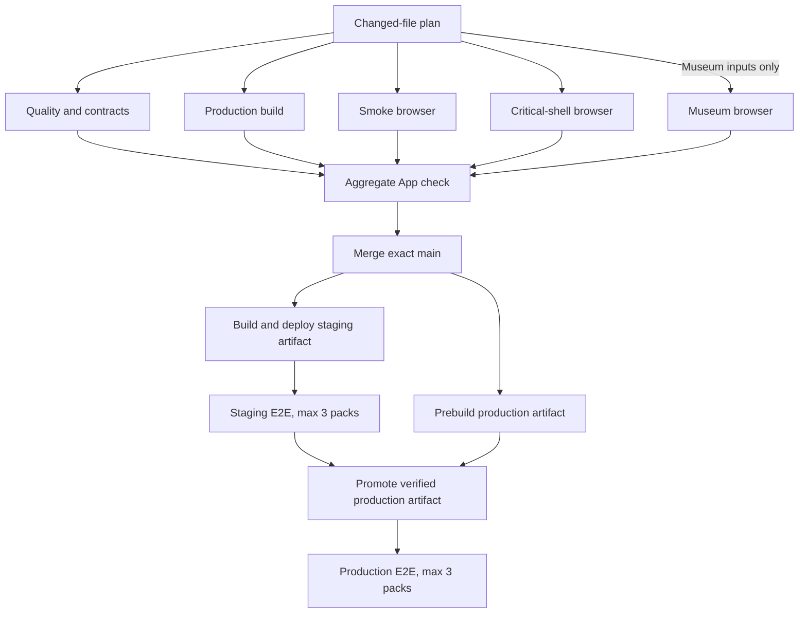

# Target pipeline

## Release graph

The production build and staging qualification overlap. Deployment consumes
the exact successful main artifact only after staging qualifies.

## Museum lane contract

The isolated desktop/mobile Museum browser lane is selected only by:

- `app/museum/network/**`
- `components/museum/**`
- `lib/museum/**`
- `config/museumPublicationEnv.server.ts`
- `i18n/messages/museum.en-US.json`
- `tests/museum/**`

The classifier is table-tested with positive and unrelated negative paths.
Museum Jest tests continue to follow normal related-test selection. The
deployed staging selector uses the same path boundary and retains the Museum
pack if it cannot prove the first-parent diff.

## Immutable production artifact

`production-build-artifact.yml` runs on trusted `main` and has no AWS or
deployment authority. It checks out and verifies the exact SHA, runs the full
generation/build/postbuild lifecycle, packages the standalone server and
static files, records a package digest and deterministic commit timestamp, and
uploads `manifest.json`, `SHA256SUMS`, and `target/**` under an exact-SHA name.

The manual production deployment:

1. requires authoritative OFF-lane readiness;
2. verifies that `main` is still exact;
3. locates an unexpired artifact for that SHA;
4. verifies its originating workflow, event, successful conclusion, branch,
   and head SHA through GitHub;
5. downloads the exact run/name pair;
6. checks every file in `SHA256SUMS`, the manifest contract, package digest,
   environment and source SHA;
7. obtains AWS authority only after verification;
8. uploads and activates the verified target without installing or building;
9. confirms runtime and announced versions.

## E2E concurrency

Parallelism applies only to manifest-declared read-only packs. Staging and
production request three pack processes. Each pack has a unique output root,
and the runner produces one completeness-checked evidence inventory.

The Museum pack remains atomic and single-worker. Sharding it would duplicate
publication, API and media traffic; a previous over-parallel qualification
already demonstrated HTTP 429 pressure. The performance target is therefore
bounded parallelism, not maximum fan-out.

## Quality invariants

- Exact PR merge-tree evidence remains required.
- Fork PRs receive no repository, staging, production or artifact-store secrets.
- External actions remain SHA-pinned.
- Candidate code builds without deployment credentials.
- Staging and production artifacts remain environment-specific.
- Deploy jobs never treat caches as evidence.
- Failed, cancelled, skipped or foreign-repository deployments cannot dispatch
  E2E.
- Automatic fallback E2E re-reads the triggering deployment run and tests its
  exact SHA.
- Production mutations remain serialized and non-cancelling.
- All deployed-environment packs remain read-only.
