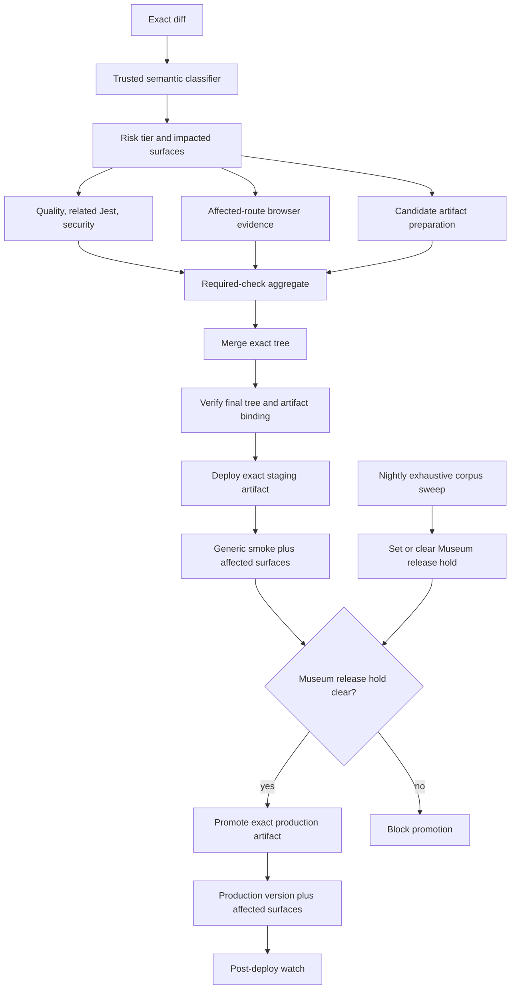

# Reengineering the Museum release path

**Historical design; deployment sections superseded on 2026-09-03.**
Current deployments follow [Deployment](../../docs/developer/deployment.md)
and the existing GitHub Actions workflows. The bus restoration, shared lease,
and coordinator requirements below no longer apply. Retain the recorded
performance findings, incident evidence, and applicable artifact/test design
for context; this document does not authorize restoring retired automation.

## Decision

The current release system has strong integrity controls and an unsuitable
unit of test selection. It asks whether any Museum-owned path changed, then
runs nearly the whole Museum browser corpus. The replacement should retain the
same release authority and evidence standards while selecting checks by the
semantic kind of change and the routes or rendering templates that can be
affected.

The fast lane is a Release Bus qualification profile. It is not a bypass, a
second deployment mechanism, a label, or an operator shortcut.

The finished system should provide three things together:

- a small presentation change receives focused evidence and reaches production
  quickly;
- a shared runtime, publication, security, or release change receives broad
  evidence automatically;
- uncertainty always escalates to the broader lane.

## Evidence from PR #3628

The release began at 2026-08-05 18:38:36.810 UTC and completed production E2E
at 20:22:56 UTC: 1 hour, 44 minutes, and 19 seconds.

| Phase                                                                      | Duration | Material finding                                                |
| -------------------------------------------------------------------------- | -------: | --------------------------------------------------------------- |
| Implementation, focused test, local desktop/mobile browser check, ready PR |    5m20s | The product change was small and correctly scoped.              |
| PR App CI                                                                  |   47m44s | The Network Museum job occupied 44m55s.                         |
| Network Museum browser step                                                |   43m03s | Institutional practice took 40.9m; Inside the System took 2.1m. |
| Staging build and deploy                                                   |   13m34s | Artifact build/package took 10m52s; deployment itself took 35s. |
| Staging E2E                                                                |   16m37s | Institutional practice took 10.2m; Inside the System took 1.4m. |
| Production deployment                                                      |    6m37s | Elastic Beanstalk health/readiness took 5m08s.                  |
| Production E2E                                                             |   11m16s | Institutional practice took 8.1m; Inside the System took 48s.   |

The PR changed two `className` values in one leaf component used only by
`/museum/network/about`. The selected institutional-practice browser suite
covered 27 museum profiles, scholarship, source tables, Casey Reas, and Keys
and Gates. It did not visit `/museum/network/about`.

This is not simply excessive coverage. It is misdirected coverage: the release
spent most of its time exercising unrelated pages while the changed page had
no dedicated hosted browser contract.

## Root causes

### 1. Binary Museum classification

`scripts/museum-e2e-change-set.cjs` returns one boolean for broad Museum-owned
path prefixes. `scripts/app-pr-ci-effective-plan.cjs` converts that boolean
into one Network Museum lane. Staging and production use the same boolean to
retain or remove every Museum pack.

The classifier cannot distinguish a leaf `className` edit from a navigation,
publication adapter, source-integrity, data-flow, media, or interaction change.

### 2. Browser tests enumerate content instances

`tests/museum/institutional-practice-readonly.spec.ts` runs one browser test for
each of 27 profiles on desktop and mobile. Those profiles use the same route
and rendering template. Titles, required sections, source links, route
inventory, and unsafe-link rules are deterministic content contracts and do
not require 54 separate browser navigations.

Browser testing should cover browser-specific risk: rendering, hydration,
layout, responsive behavior, focus, accessibility, media loading, navigation,
console errors, and failed responses. Static tests should cover exhaustive
content and mapping invariants.

The same suite is declared serial, runs with one worker, and permits two
retries. In #3628 an actionable React missing-key warning on an unrelated
Casey route failed the first desktop pass. Playwright restarted the serial
group twice before it passed, producing the 40.9-minute result. The warning
must be fixed, not suppressed. Template-owned shards should retain retry and
console diagnostics without allowing one instance failure to replay the whole
Museum corpus.

### 3. Every release rebuilds 31,716 static pages

The #3628 staging build spent 2.8 minutes compiling, 1.8 minutes running
TypeScript, and 5.0 minutes generating 31,716 static pages with three workers.
A warm `.next/cache` did not avoid the static generation work.

Production builds an environment-specific artifact in parallel, which is an
important existing optimization, but staging cannot begin qualification until
its own full build completes.

### 4. Production health checking is coarse

The production workflow sleeps for 120 seconds before its first readiness
check and then polls at 60-second intervals. In #3628 that step consumed 5m08s.
The workflow can retain stable-state health requirements while observing them
at a materially finer interval.

### 5. The fast policy is candidate-influenced

The candidate merge tree contains the planner, classifier, pack manifest, and
workflow code that reports required checks. Before a narrower lane is trusted,
the approved classifier and policy digest must be verified from protected
default-branch or Release Bus tooling. A candidate must not be able to redefine
the rules that classify its own diff.

### 6. Setup and cache work is duplicated

App CI lanes independently check out, install dependencies, install Chromium,
and start Playwright servers. The changed Jest test also ran directly and
again through `--findRelatedTests`. Smoke and Museum lanes raced to populate
the same browser cache. In the Release Bus preflight path, `.next/cache` is
restored and then removed when the build deletes all of `.next`.

These are secondary to correct test selection, but they are concrete waste.
The pipeline should deduplicate related Jest inputs, prepare immutable runner
dependencies once per runner image, preserve only the intended Next cache
subdirectory, and run related Museum packs through one managed server where
isolation does not require otherwise.

## Proposed release model

Review bots, quality checks, focused browser evidence, and artifact preparation
run concurrently. Staging deployment precedes staging E2E. Production selection
remains a separate exact-SHA action after staging validation. Production
mutations remain serialized.

## Risk classification

The release tier is the maximum tier produced by every changed file and every
changed syntax node. Labels, titles, branch names, and operator declarations
cannot lower it.

| Tier                      | Examples                                                                                                                                                                     | Browser scope                                                                     |
| ------------------------- | ---------------------------------------------------------------------------------------------------------------------------------------------------------------------------- | --------------------------------------------------------------------------------- |
| P0: leaf presentation     | Literal Tailwind token changes on existing JSX nodes in a registered leaf component; assertion-only focused test changes                                                     | Exact affected routes on desktop and 390px mobile, plus source and shell sentinel |
| P1: route presentation    | Static copy, existing localized values, leaf layout structure, safe raster assets, or route-local markup with no behavior/data changes                                       | Affected routes and their distinct template representatives                       |
| P2: Museum runtime        | Imports, exports, JSX control flow, interactions, media behavior, navigation, shared Museum shell, server/client boundary, or route data loading                             | Every affected Museum template; full static corpus contracts                      |
| P3: integrity or platform | Publication/source adapters, manifests, security, environment, Next config, dependencies, workflows, release tooling, test infrastructure, or unknown/unclassifiable changes | Full relevant application and Museum qualification                                |

### P0 proof

P0 requires structural AST equivalence outside approved literal `className`
attributes. The classifier should use the TypeScript compiler or the existing
`ts-morph` dependency, not regular expressions.

It must reject or escalate:

- import, export, function, hook, handler, expression, or JSX-tree changes;
- changes to `href`, `src`, `role`, `aria-*`, `tabIndex`, headings, conditionals,
  keys, or component props;
- arbitrary Tailwind content, URL, visibility, pointer, interaction, or unsafe
  positioning utilities unless explicitly admitted by policy;
- global CSS, fonts, SVG, HTML, config, generated files, dependencies, or public
  runtime assets;
- renames, mode changes, symlinks, submodules, malformed paths, parser failures,
  incomplete Git history, or policy-digest mismatch.

The #3628 component diff is the acceptance fixture for a valid P0 decision.

### Trusted execution

The classifier, surface registry, check policy, and policy digest must come
from protected tooling. A PR that changes any of those files is P3 under the
previous trusted policy. Release Bus independently verifies the policy digest,
required check inventory, exact base/head/merge trees, and evidence producer.

Failure to classify does not fail the product change. It sends the change to
the ordinary broad lane.

## Museum surface registry

Add one versioned registry that relates source ownership, routes, rendering
templates, static contracts, and browser packs. It replaces duplicated path
lists and literal pack aliases.

Each surface record should contain:

- stable surface ID;
- route patterns and representative concrete routes;
- owning page and component modules;
- reverse-import boundaries;
- rendering template ID;
- required static contract suites;
- required PR, staging, and production browser projects;
- source-integrity and media requirements;
- minimum risk tier for shared dependencies.

The import graph is generated with `ts-morph`. A contract test proves that
every `app/museum/network/**/page.tsx`, Museum-owned component, and Museum E2E
spec belongs to at least one surface. An unmapped changed module escalates.

For the example change, the registry resolves
`MuseumNetworkProposition.tsx` to `museum.about.proposition`, whose concrete
route is `/museum/network/about`.

## Rebuild the Museum test topology

### Static corpus contracts

Move these exhaustive assertions out of browser enumeration:

- all 27 institutional-practice profile routes exist;
- every profile has its title, required sections, lessons, limits, source path,
  and exact publication relation;
- all source URLs are HTTPS and credential-free;
- the complete source register and route/source mapping are coherent;
- Casey, Keys and Gates, and project/object inventories contain the required
  records and relationships;
- publication activation is atomic and exact-source-bound.

These checks run in Jest or a purpose-built Node validator against the exact
publication object and complete in seconds.

### Browser template contracts

Browser packs cover distinct behavior rather than every content instance:

1. Museum home and shell;
2. About/proposition;
3. collection and artist;
4. gift and object;
5. program and selected-unminted object;
6. story/Markdown article;
7. institutional-practice index;
8. one representative institutional profile;
9. source/table route;
10. Inside the System interactive project.

Each affected pack runs desktop and 390px mobile checks for route readiness,
accessibility, keyboard focus where applicable, no overflow, clean console,
no failed responses, images/media, safe links, exact source identity, and a
small stable screenshot or computed-style contract where visual behavior is
the subject of the change.

For #3628, the selected pack would visit `/museum/network/about` and assert the
computed font size, line height, color hierarchy, 390px overflow boundary, and
source panel. It would not visit 27 unrelated museum profiles.

### Exhaustive browser sweep

Keep the complete profile-by-profile browser sweep as:

- a nightly production canary;
- an on-demand diagnostic;
- a required gate for changes to the institutional-practice template, shared
  Markdown renderer, publication adapter, source-security boundary, or the
  sweep itself.

A red nightly Museum baseline creates a Release Bus Museum hold. Moving the
sweep off a leaf change's critical path does not make persistent regressions
optional.

## PR checks by tier

| Check                                              |              P0               |             P1             |           P2           |  P3   |
| -------------------------------------------------- | :---------------------------: | :------------------------: | :--------------------: | :---: |
| Trusted plan, secret/workflow scan, frozen install |              yes              |            yes             |          yes           |  yes  |
| Changed lint, changed typecheck, related Jest      |              yes              |            yes             |          yes           |  yes  |
| Static Museum corpus contracts                     |           sentinel            |          affected          |          full          | full  |
| Route/template browser evidence                    |        affected route         |     affected templates     | all affected templates | broad |
| Production build in PR                             | no; release artifact is fresh |         risk-based         |          yes           |  yes  |
| Release/dependency/security contracts              |  if touched, tier escalates   | if touched, tier escalates |       if touched       |  yes  |

The existing risk floor remains authoritative. Presentation classification can
narrow a browser profile; it cannot lower an existing security or dependency
risk floor.

## Build and artifact engineering

### Immediate build improvements

1. Provision an ephemeral high-CPU Linux runner and set the already-supported
   `CI_BUILD_RUNNER`, `STAGING_BUILD_RUNNER`, and `PRODUCTION_BUILD_RUNNER`
   variables only after benchmark evidence. No unprovisioned label enters a
   workflow.
2. Benchmark 8, 16, and 32 vCPU shapes against the same exact main SHA. Record
   compile, TypeScript, static generation, packaging, p50, p95, and cost per
   successful artifact.
3. Use shallow exact-SHA checkout for browser/build lanes that do not need Git
   history. The quality/classifier lane retains the necessary base history.
4. Use an immutable runner image with Node, the pinned pnpm/Corepack toolchain,
   Chromium, and system dependencies. Dependency lock verification still runs.
5. Suppress duplicate Next build typechecking only when a full exact PR
   merge-tree typecheck has run after `.next` type generation and the artifact
   inputs remain unchanged. Otherwise Next typechecking stays enabled. The
   build still fails on compilation, generation, packaging, and route errors.

### Reduce static generation

Audit every `generateStaticParams` contributor to the 31,716-page build.
High-cardinality token, collection, and archive routes should use ISR or
on-demand rendering unless pre-rendering the entire cardinality has a measured
product requirement. Keep a small, explicit hot set where pre-rendering
materially improves public access.

The acceptance target is fewer than 2,000 generated pages or a measured static
generation phase below 60 seconds on the selected build runner.

### One artifact, promoted twice

The durable design is one runtime-configured immutable frontend artifact:

- environment endpoints, chain ID, public runtime flags, and deployed release
  SHA move to a signed runtime configuration contract;
- server-only secrets remain runtime secrets and never enter client bytes;
- source-map upload is a separate trusted side effect;
- the artifact is content-addressed by source tree, toolchain, generated inputs,
  and build policy;
- staging and production manifests bind the same package digest to different
  runtime-config digests and exact deployed SHAs.

This allows candidate artifact preparation to run in parallel with PR review.
After squash merge, Release Bus proves that the final main tree equals the
reviewed merge tree before reusing the artifact. A changed base or changed tree
invalidates it and rebuilds automatically.

Until runtime-neutral artifacts land, keep the current environment-bound
staging and production artifacts and build them concurrently on the larger
runner. Do not weaken environment or package digest checks.

## Deployment improvements

1. Restore Simple Release Bus v2 as the sole automated mutation authority.
   Manual OFF-lane fallback remains an emergency path, not the performance
   design.
2. Replace the fixed 120-second production sleep and 60-second polling interval
   with 10-second observation, requiring stable healthy/ready state across
   multiple consecutive samples plus exact HTTP-version confirmation.
3. Prepare immutable S3 objects and the Elastic Beanstalk application version
   before production selection when that preparation does not mutate the live
   environment. Production selection still occurs only after staging passes.
4. Benchmark a pre-warmed blue/green target. Adopt it only if CNAME/traffic
   switching, rollback, health evidence, and cost are better than the improved
   in-place deployment.

## Parallelism

The following work should run concurrently:

- review bots, quality checks, focused browser evidence, and artifact
  preparation;
- staging-profile and production-profile builds while environment-bound
  artifacts remain;
- independent read-only E2E packs, with current bounded failed-pack retry;
- static corpus validation and route browser validation.

The following dependencies remain serialized because they are semantic safety
boundaries:

- staging deploy before staging E2E;
- successful staging validation before production selection;
- one production mutation at a time;
- deployment before deployed-version and production browser evidence.

## Service-level objectives

SLOs include GitHub queue and setup time. They are measured from ready PR to
successful production E2E; authoring time is reported separately.

| Release class         | Interim p95 with current artifact architecture |    Final p95 |
| --------------------- | ---------------------------------------------: | -----------: |
| P0 leaf presentation  |                                     40 minutes |   25 minutes |
| P1 route presentation |                                     50 minutes |   35 minutes |
| P2 Museum runtime     |                                     70 minutes |   50 minutes |
| P3 integrity/platform |       evidence-led; no artificial speed target | evidence-led |

P0 stage budgets in the finished system:

| Stage                            |                                               p95 budget |
| -------------------------------- | -------------------------------------------------------: |
| Classification and plan          |                                                      30s |
| Merge-ready PR checks and bots   |                                                       6m |
| Exact artifact ready after merge | 5m, or immediate when reviewed-tree artifact is reusable |
| Staging deploy                   |                                                       2m |
| Staging qualification            |                                                       3m |
| Production promotion             |                                                       5m |
| Production qualification         |                                                       3m |
| Orchestration gaps               |                                                30s total |

No target is set for the percentage of changes admitted to P0. Such a target
would reward unsafe under-classification.

## Fail-closed rules

- Unknown syntax, paths, imports, routes, templates, or Git ranges escalate.
- A cumulative staging composition receives the maximum tier of every included
  change. A P0 PR combined with a P2 PR is P2.
- The caller cannot manually remove a required pack.
- Missing, duplicate, skipped, mutating, foreign, stale, or unbound evidence
  cannot satisfy qualification.
- Classifier, registry, workflow, pack-manifest, E2E-helper, and policy changes
  are P3 under the prior trusted policy.
- Artifact source, environment/runtime configuration, package digest, or exact
  deployed-version mismatch fails before promotion.
- Staging remains locked during manifest-bound E2E.
- Rollback is forward-only to an exact last-validated tree and receives the
  same deployed-version proof.

## Observability

Every release emits one immutable timing and decision record containing:

- policy version and trusted digest;
- exact base, head, merge, composed, artifact-tree, staging, and production
  SHAs;
- normalized diff digest, tier, affected surfaces, and escalation reasons;
- required and observed check inventories;
- queue, setup, checkout, install, compile, typecheck, static generation,
  packaging, deployment, health, and per-pack durations;
- artifact, package, and runtime-config digests;
- staging and production version readbacks;
- browser routes, projects, read-only assertion, source identity, and evidence
  hashes;
- post-deploy watch and rollback boundary.

The pipeline publishes p50/p95 by tier weekly. A stage exceeding its p95 budget
opens or updates a performance incident automatically; it does not relabel a
slow release as successful.

## Implementation sequence

### PR 1: measurement and trusted policy boundary

- Add structured stage timing and selected-check evidence.
- Fix the existing React missing-key warning that amplified #3628 retries;
  preserve the diagnostic and retry policy.
- Deduplicate direct and related Jest selections and stop destructive removal
  of a restored Release Bus Next cache.
- Pin the classifier/registry policy to protected tooling.
- Add report-only P0-P3 classification.
- Prove current planner/workflow/test infrastructure changes always escalate.

No check is removed in this PR.

### PR 2: Museum surface registry and static corpus contracts

- Add the complete Museum surface registry and reverse-import validation.
- Port exhaustive profile, source, route, and relationship assertions to static
  contracts.
- Add the direct About/proposition browser pack.
- Split the current large Museum specs into template-owned packs.

Run old and new browser suites together in shadow.

### PR 3: activate P0 selection

- Require zero under-classification across at least 20 report-only PRs or
  synthetic fixtures plus 10 shadow releases.
- Select affected routes for P0 at PR, staging, and production.
- Keep the old full sweep nightly and for P2/P3.
- Add the nightly-to-Release-Bus Museum hold.

Rollback is one policy switch that restores every Museum pack.

### PR 4: build-runner benchmark and activation

- Provision an ephemeral trusted build runner outside untrusted fork execution.
- Benchmark exact-SHA 8/16/32-vCPU builds.
- Set runner variables only for the winning measured shape.
- Retain `ubuntu-latest` as the tested fallback.

### PR 5: build cardinality and duplicate-work reduction

- Move high-cardinality static routes to measured ISR/on-demand rendering.
- Consume exact PR typecheck evidence during trusted artifact builds.
- Enforce the static-generation and total-build budgets.

### PR 6: runtime-neutral artifact and deployment polling

- Introduce the signed runtime configuration contract.
- Build once and bind the same package digest to staging and production.
- Prepare reviewed-tree artifacts in parallel with PR checks.
- Add stable 10-second production health polling and evaluate blue/green.
- Restore normal Release Bus v2 automation after its control-plane gate passes.

## Acceptance benchmark

The redesign is complete only when all of these are demonstrated:

1. The exact #3628 diff classifies P0 and selects `/museum/network/about` only
   from the Museum surface inventory.
2. The focused route test fails for seeded font-floor, contrast, overflow,
   unsafe-link, console-error, failed-response, source-identity, and mobile
   regressions.
3. Seeded import, handler, conditional, route, publication, config, workflow,
   dependency, symlink, malformed-path, and policy changes escalate.
4. Every Museum route, component, and browser spec is registry-owned; deleting
   a mapping fails CI.
5. Exhaustive static corpus tests cover every profile and public record while
   representative browser tests cover every distinct rendering template.
6. Missing or foreign classifier policy, pack inventory, artifact digest,
   source identity, or runtime version fails closed.
7. A P0 plus P2 cumulative candidate runs P2 evidence.
8. Staging and production E2E remain read-only and manifest-bound.
9. The full nightly sweep can set and clear the Museum release hold with an
   auditable result.
10. Twenty consecutive P0 benchmark releases meet the 25-minute p95 without an
    escaped regression or manual check downgrade.

## Ideas incorporated and rejected

The proposal keeps the useful work already merged through PRs `#3593`, `#3597`,
`#3598`, `#3599`, `#3603`, `#3604`, `#3605`, and `#3608`: parallel App CI, exact artifacts,
cache boundaries, failed-pack-only retry, centralized Museum scope, and
non-runtime prebuild exclusions.

It also incorporates the route-family and canary concepts from older PRs
`#3191`-`#3193`, but not their stale branches. The current CJS pack manifest remains
the source of truth.

PR #3586's Deploy Hub is not part of this design. A second mutation plane would
increase authority and concurrency risk. Release Bus remains the single
release authority.

More workers are not the primary answer for the 27-profile browser sweep. A
prior broad fan-out produced HTTP 429 pressure, and it would still test the
wrong unit. The primary fix is to move exhaustive content invariants to static
contracts and test distinct browser templates. Bounded parallelism remains
appropriate for independent read-only packs.
